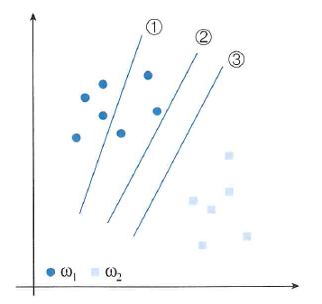
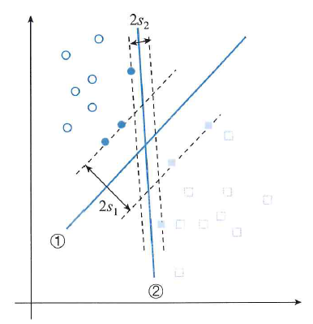
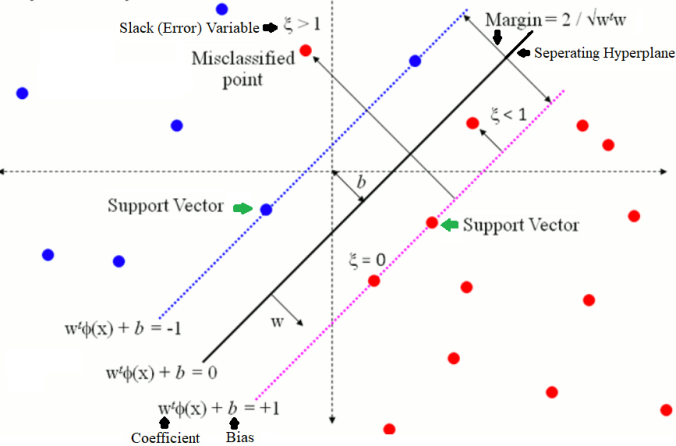
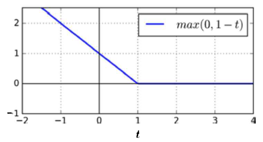
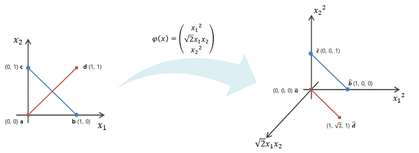

> 이번 SVM 관련 포스팅은 '*오일식 저, [패턴인식](http://www.yes24.com/24/goods/3315437?scode=032&OzSrank=7)*' 교재와 '[*핸즈온 머신러닝*](http://www.yes24.com/24/goods/59878826?scode=032&OzSrank=1)' 그리고 '[*ratsgo*](https://ratsgo.github.io/machine%20learning/2017/05/23/SVM/)' 블로그를 참고하여 작성하였습니다. 

# SVM 이란?

아래의 그림에서 ① 분류기는 Train set을 틀리게 분류한다. 이를 여러번 학습시켜 모델링하면 ②와 ③ 분류기와 같이 될것이다. 

Train set 측면에서 보면 ②와 ③ 분류기는 오류가 0이므로 같은 성능을 가진 분류기로 볼 수 있다. 하지만, 일반화(generalization) 측면에서 보면 ② 보다 ③이 더 낫다고 할 수 있다. 그 이유는 ③ 분류기가 두 개의 클래스에 대해 **여백**(margin) 크기 때문이다. 

바로 여기서 이러한 여백, 즉 마진을 어떻게 공식화하고 이 마진을 최대화하는 결정 초평면(decision hyperplane)을 찾는 것이 바로 SVM의 발상이라 할 수 있다.

## 1. 결정 함수와 예측

Linear SVM은 두 클래스를 분리하기 위한 선형 결정 함수를 찾는 것이며, 이러한 결정 함수는 다음과 같이 나타낼 수 있다.

$$
d (\mathbf{x}) = \mathbf{w}^{T} \mathbf{x} + b = 0
$$

- $d(x)$는 전체 특성 공간을 두 영역으로 분할한다.
    - $d(x) = \mathbf{w}^{T} \mathbf{x} + b > 0$ → $w_1$
    - $d(x) = \mathbf{w}^{T} \mathbf{x} + b < 0$ → $w_2$

- 하나의 초평면을 표현하는 식은 여러가지가 있다.
    - $c \times (\mathbf{w}^{T} \mathbf{x} + b) = 0$

- $\mathbf{w}$는 초평면의 **법선벡터**다.
    - $\mathbf{w}$은 초평면의 방향을 나타내고, $b$는 위치를 나타낸다.

- 임의의 점 $\mathbf{x}$에서 초평면까지 거리는 $h = \frac{|d(x)|}{\| \mathbf{w} \|}$ 이다.

 

## 2. 목적 함수

SVM에서 풀고자 하는 문제는 아래의 그림에서 마진(margin)을 가장 크게하는 결정 초평면의 방향, 즉 $\mathbf{w}$
를 찾는 것이다.

위의 그림에서 마진은 색이 칠해진 데이터 포인트에 의해 좌우된다. 이러한 데이터 포인트를 **서포트 벡터**(Support Vector)라고 한다. 서포트 벡터($\mathbf{x}$)에 대한 마진은 다음과 같다.

$$
\text{margin} = \frac{2 |d(\mathbf{x})|}{\left\| \mathbf{w} \right\|} = \frac{2}{\left\| \mathbf{w} \right\|}
$$

 

Train set을 $\mathbb{X} = \{ (\mathbf{x}_1, t_1), \dots , (\mathbf{x}_n, t_n) \}$ 로 표기하자. $t_i$는 클래스를 나타내며, $w_1$에 속하면 $t_i = 1$이고, $w_2$에 속하면 $t_i = -1$이 된다. 

위와 같은 조건 하에 최대 마진을 갖는 결정 초평면을 찾는 것은 **조건부 최적화 문제**(constrained optimization porblem)로 나타낼 수 있다. 아래의 조건식에서 등호(=)가 성립하는 데이터 포인트가 바로 서포트 벡터이다. 

아래와 같이 최대 마진을 구하는 문제를 역수를 취해, 최소화하는 문제로 바꿀 수 있다.

$$
\max{ \frac{2}{\| \mathbf{w} \|} } \rightarrow \min{\frac{1}{2} \| \mathbf{w} \|^{2}} = \min{\frac{1}{2} \mathbf{w}^{T} \cdot \mathbf{w} }
$$

$$
\text{s.t.}\quad t_i \left( \mathbf{w}^{T} \mathbf{x}_i + b \right) \ge 1 \quad i = 1, \dots , n
$$

 

  

위의 문제의 두 가지 측면에서 보면 다음과 같다.

- **해의 유일성(uniqueness)**
    - $\mathbf{w}$의 2차항만 가지므로 볼록(convex)한 함수이며, 조건식은 $n$개 모두 선형이다. 따라서, 유일한 해를 가진다.

- **문제의 난이도**
    - 위의 문제는 $n$개의 선형 부등식을 가진 2차함수의 최적화 문제이며, $n$의 개수는 엄청나게 클 수 있다. 이러한 경우에 **라그랑제 승수**(Lagrange multiplier)를 이용해 해결할 수 있다.

 

### 1) 라그랑제 승수법

위의 문제를 살펴보기 전에 먼저 라그랑제 승수법(Lagrange multiplier method)에 대해 알아보자. 

라그랑제 승수법의 기본 개념은 제약이 있는 최적화 문제에서 목적함수로 제약을 옮김으로써 제약이 없는 문제로 변환하는 것이다. 

간단한 예로 라그랑제 승수법을 살펴보도록 하자. 아래와 같이 **등식 제약**의 조건 하에서 함수 $f(x, y)$를 최소화 하는 $x, y$를 찾는 문제를 보자.

$$
\min{f(x,y) = x^2 + 2y}
$$

$$
\text{s.t.} \quad 3x+2y+1 = 0 
$$

위의 식을 라그랑제 승수법을 사용하기 위해 **라그랑제 함수**(Lagrangian, Lagrange function)로 다음과 같이 정의하자.

$$
L(x, y, \alpha) = f(x, y) - \alpha \left( 3x + 2y +1 \right) = x^2 + 2y - \alpha \left( 3x + 2y +1 \right)
$$

조제프루이 라그랑제(Joseph-Louis Lagrange)는 위의 라그랑지안 함수 $L(\cdot)​$처럼 $(\hat{x}, \hat{y})​$가 제약이 있는 최적화 문제의 해라면, $(\hat{x}, \hat{y}, \hat{\alpha})​$가 함수 $L(\cdot)​$의 **정류점**(stationary point) 즉, 모든 편도함수(partial derivative)가 0인 지점이 되는 $\hat{\alpha}​$가 존재한다는 것을 보였다.

따라서, $x, y, \alpha$에 대한 라그랑지안 $L(x, y, \alpha)$의 편도함수를 계산할 수 있으면 이 도함수가 모두 0이 되는 지점을 찾을 수 있고, 제약이 있는 최적화 문제의 해는 이런 정류점 중에 있어야 한다.

위의 식에서 편도함수는 다음과 같다.

$$
\frac{\partial}{\partial x} L(x, y, \alpha) = 2x - 3\alpha
$$

$$
\frac{\partial}{\partial y} L(x, y, \alpha) = 2 - 2 \alpha
$$

$$
\frac{\partial}{\partial \alpha} L(x, y, \alpha) = -3x -2y -1
$$

모든 편도함수가 0이면, $2 \hat{x} - 3 \hat{\alpha} = 2 - 2 \hat{\alpha} = -3 \hat{x} - 2 \hat{y} - 1=0$ 이므로, $\hat{x} = \frac{3}{2}$, $\hat{y} = - \frac{11}{4}$, $\hat{\alpha} = 1$을 계산할 수 있다.

#### 라그랑제 함수로 변환

위의 조건식에서 각 조건식 마다 라그랑제 승수 $\alpha_i$를 부여한다. 이들의 벡터를 $\mathbf{\alpha} = (\alpha_1, \dots , \alpha_n)^{T}$로 표기하자. 

$$
L(\mathbf{w}, b, \mathbf{\alpha}) = \frac{1}{2} \| \mathbf{w} \|^{2} - \sum_{i=1}^{n}{\alpha_{i} \left( t_{i} \left( \mathbf{w}^{T} \mathbf{x}_{i} +b \right) -1 \right)}
$$

### 2) KKT(Karush-Kuhn-Tucker) 조건

위에서 살펴본 예제는 등식 제약 조건부 최적화 문제였다. 하지만, SVM은 **부등식 제약**(inequality constrained) 최적화 문제이다(예를들어 $3x + 2y + 1 \ge 0$). 

이러한 부등식 제약 최적화 문제는 다음과 같이 세 가지 **KKT**조건을 이용해 풀수 있다. KKT 조건은 **필요 조건** 이므로 반드시 만족해야 한다.

- 라그랑제 함수 $L(\mathbf{w}, b, \mathbf{\alpha})$에서 라그라제 승수를 제외한 $\mathbf{w}, b$로 편미분한  식이 $0$이되어야 한다.

$$
\frac{\partial L(\mathbf{w}, b, \mathbf{\alpha})}{\partial \mathbf{w}} = \frac{\partial L(\mathbf{w}, b, \mathbf{\alpha})}{\partial b} = 0
$$

- 모든 라그랑제 승수 $\mathbf{\alpha} = \{ \alpha_1, \dots, \alpha_n \}$은 0보다 크거나 같아야 한다.

$$
\alpha_i \ge 0, \quad i = 1, \dots, n
$$

- 모든 조건식에 대해 $\alpha_i = 0$ 이거나 $t_{i} \left( \mathbf{w}^{T} \mathbf{x}_{i} +b \right) -1 = 0$ 이 되어야 한다. 이때, $t_{i} \left( \mathbf{w}^{T} \mathbf{x}_{i} +b \right) = 1$인 데이터 포인트가 바로 **서포트 벡터**이다.

 

## 3. Wolfe 쌍대(Dual) 문제

위에서 SVM 문제는 볼록 성질을 만족한다는 것을 알 수 있었다. 이러한 볼록 성질을 만족하는 조건부 최적화 문제는 **Wolfe dual** 문제로 변환할 수 있다. 

- 원래(primal) 문제가 $f_i (\theta) \ge 0$, $i = 1, \dots, n$이라는 조건 하에 $J(\theta)$를 최소화 하는 문제라고 하면 쌍대(dual) 문제는 $\partial L(\theta, \alpha)/\partial \theta = 0$과 $i = 1, \dots, n$이라는 두 가지 조건 하에 $L(\theta, \alpha) = J(\theta) - \sum_{i=1}^{n}{\alpha_i f_i(\theta)}$ 를 최대화 하는 문제로 표현할 수 있다.

따라서, 위의 라그랑지안 SVM 문제를 쌍대 문제로 나타내면 다음과 같다.

$$
\begin{align*}
\frac { \partial L(w,b,{ \alpha  }_{ i }) }{ \partial w } =0\quad &\rightarrow \quad w=\sum _{ i=1 }^{ n }{ { \alpha  }_{ i }{ t }_{ i }{ x }_{ i } } \\ \frac { \partial L(w,b,{ \alpha  }_{ i }) }{ \partial b } =0\quad &\rightarrow \quad \sum _{ i=1 }^{ n }{ { \alpha  }_{ i }{ t }_{ i } } =0
\end{align*}
$$

위의 식을 $L(\mathbf{w}, b, \mathbf{\alpha})$에 대입하여 정리하면 다음과 같다.

$$
\begin{align*}
\frac { 1 }{ 2 } { \left\| w \right\|  }^{ 2 }&=\frac { 1 }{ 2 } { w }^{ T }w\\ &=\frac { 1 }{ 2 } { w }^{ T }\sum _{ j=1 }^{ n }{ { \alpha  }_{ j }{ t }_{ j }{ x }_{ j } } \\ &=\frac { 1 }{ 2 } \sum _{ j=1 }^{ n }{ { \alpha  }_{ j }{ t }_{ j }{ ({ w }^{ T }x }_{ j }) } \\ &=\frac { 1 }{ 2 } \sum _{ j=1 }^{ n }{ { \alpha  }_{ j }{ t }_{ j }{ (\sum _{ i=1 }^{ n }{ { \alpha  }_{ i }{ t }_{ i }{ x }_{ i }^{ T }{ x }_{ j } }  }) } \\ &=\frac { 1 }{ 2 } \sum _{ i=1 }^{ n }{ \sum _{ j=1 }^{ n }{ { \alpha  }_{ i }{ { \alpha  }_{ j }t }_{ i }{ t }_{ j }{ x }_{ i }^{ T }{ x }_{ j } }  } 
\end{align*}
$$

$$
\begin{align*}
-\sum _{ i=1 }^{ n }{ { \alpha  }_{ i }({ t }_{ i }({ w }^{ T }{ x }_{ i }+b)-1) } &=-\sum _{ i=1 }^{ n }{ { \alpha  }_{ i }{ t }_{ i }({ w }^{ T }{ x }_{ i }+b) } +\sum _{ i=1 }^{ n }{ { \alpha  }_{ i } } \\ &=-\sum _{ i=1 }^{ n }{ { \alpha  }_{ i }{ t }_{ i }{ w }^{ T }{ x }_{ i } } -b\sum _{ i=1 }^{ n }{ { \alpha  }_{ i }{ t }_{ i } } +\sum _{ i=1 }^{ n }{ { \alpha  }_{ i } } \\ &=-\sum _{ i=1 }^{ n }{ \sum _{ j=1 }^{ n }{ { \alpha  }_{ i }{ { \alpha  }_{ j }t }_{ i }{ t }_{ j }{ x }_{ i }^{ T }{ x }_{ j } }  } +\sum _{ i=1 }^{ n }{ { \alpha  }_{ i } }
\end{align*}
$$

최종적으로 다음과 같이 Dual 문제로 쓸 수 있다.
$$
\max { { L }({ \alpha  }_{ i }) } =\sum _{ i=1 }^{ n }{ { \alpha  }_{ i } } -\frac { 1 }{ 2 } \sum _{ i=1 }^{ n }{ \sum _{ j=1 }^{ n }{ { \alpha  }_{ i }{ { \alpha  }_{ j }t }_{ i }{ t }_{ j }{ x }_{ i }^{ T }{ x }_{ j } }  }
$$

$$
\text{s.t.} \quad \sum _{ i=1 }^{ n }{ { \alpha  }_{ i }{ t }_{ i } } =0
\\{ \alpha  }_{ i }\ge 0,\quad i=1,...,n
$$

 

위의 식은 다음과 같은 특징이 있다.

- 하나의 등식 조건과 $n$개의 부등식 조건을 가진 **2차(quadratic)** 목적함수의 최대화 문제이다.
- $\mathbf{w}$와 $b$가 사라졌으므로, 라그랑제 승수 $\mathbf{\alpha}$를 구하는 문제가 되었다. 따라서, $\mathbf{\alpha}$를 구하면 $\mathbf{w}$와 $b$를 구할 수 있다.
- 목적함수에서 특성 벡터 $\mathbf{x}_i$가 **내적** $\mathbf{x}_{i}^{T} \cdot \mathbf{x}_{j}$로 나타난다. 이러한 점은 선형 SVM을 비선형 SVM으로 즉, **Kernel SVM**으로 확장하는데 결정적인 역할을 한다.

 

## 4. Soft Margin SVM

아래의 그림처럼 여유 변수(slack varibles, $\zeta$)를 추가한 소프트 마진 SVM(soft margin SVM)의 목적함수는 다음과 같다. 

$$
\min{\frac{1}{2} \| \mathbf{w} \|^{2}} + C \sum_{i=1}^{m}{\zeta_{i}}
$$

$$
\text{s.t.}\quad t_i \left( \mathbf{w}^{T} \mathbf{x}_i + b \right) \ge 1 - \zeta_{i} \quad i = 1, \dots , n, \quad \zeta_i \ge 0
$$

위의 식을 다음과 같이 해석할 수 있다. 

> Margin을 최대한 크게 하며, 동시에 $\zeta > 0$인 테이터의 수를 최소한으로 하는 결정 초평면의 방향 $\mathbf{w}$를 찾아라.

 

위의 식에서 $C$는 일종의 **penalty**라고 볼 수 있다. 

- $C$를 작게한다는 것은 마진을 나타내는 첫번째 항 ($\frac{1}{2} \| \mathbf{w} \|^{2}$)을 중요하게 생각하는 것으로 볼 수 있다.
- 반대로 $C$를 크게한다는 것은 마진을 줄이는 대신 마진 사이에 존재하는 데이터 그리고 틀린 데이터의 수를 줄이겠다는 의미이다.

 

### Loss Function

Soft Margin SVM은 어느정도의 오류를 포함하기 때문에 이를 손실함수(loss function)를 이용해 최적화 할 수 있다.
위의 Soft Margin SVM 의 제약식,

$$
t_i \left( \mathbf{w}^{T} \mathbf{x}_i + b \right) \ge 1 - \zeta_{i}
$$

은 다음과 같이 나타낼 수 있다.

$$
\zeta_{i} = \max{\left( 0,1 - t_i \left( \mathbf{w}^{T} \mathbf{x}_i + b \right) \right)}
$$

따라서, 위의 식을 손실함수 측면에서 보면 다음과 같이 손실함수를 정의할 수 있다.

$$
J(\mathbf{w}, b) = \frac{1}{2} \| \mathbf{w} \|^{2} + C \sum_{i=1}^{n}{\max{\left( 0,1 - t_i \left( \mathbf{w}^{T} \mathbf{x}_i + b \right) \right)}}
$$

$\max{0,1-t}$ 형태를 **hinge loss** 함수라고 한다. 

 

## 6. Kernel SVM

선형으로 분리되지 않는 데이터를 비선형 매핑, 즉 커널 함수를 이용해 저차원($\text{L}$)에서 고차원($\text{H}$)으로의 매핑(mapping)을 통해 해결할 수 있다. 이러한 커널함수를 이용하는 SVM을 Kernel SVM이라 한다.

커널함수는 두 개의 벡터(데이터)를 입력으로 가지며, $K(\mathbf{a}, \mathbf{b})$형태로 나타낸다. 이러한 커널 함수는 다음 성질을 만족해야 한다.

- $\mathbf{L}$ 공간 상의 두 벡터 $\mathbf{a}$와 $\mathbf{b}$를 입력 변수로 갖는 커널 함수 $K(\mathbf{a}, \mathbf{b})$는 $K(\mathbf{a}, \mathbf{b}) = \Phi (\mathbf{a}) \cdot \Phi (\mathbf{b})$를 만족하는 매핑 함수 $\Phi(\cdot)$가 존재해야 한다. 이를 **머서(Mercer)의 정리**라고 한다.
- 즉, 커널함수의 값과 $\mathbf{H}$상으로 매핑된 두 점 $\Phi(\mathbf{a})$와 $\Phi(\mathbf{b})$의 내적이 같아야 한다.

위의 성질을 간단한 예를 통해서 알아보자. 2차원의 공간을 3차원의 공간으로 매핑하는 커널함수는 다음과 같이 나타낼 수 있다. 

두개의 벡터를 $\mathbf{a} = (a_1, a_2)^{T}$, $\mathbf{b} = (b_1, b_2)^{T}$ 

$$
\begin{align*}
K \left(\mathbf{a}, \mathbf{b} \right) &= \left( \mathbf{a} \cdot \mathbf{b} \right)^{2} \\ &= a_{1}^{2}b_{1}^{2} + 2a_1b_1a_2b_2 + a_{2}^{2}b_{2}^{2} \\ &= \left( a_{1}^{2}, \sqrt{2}a_1a_2, a_{2}^{2} \right) \cdot \left( b_{1}^{2}, \sqrt{2}b_1b_2, b_{2}^{2} \right)^{T} \\ &= \Phi(\mathbf{a})^{T} \cdot \Phi(\mathbf{b})
\end{align*}
$$

$$
\Phi(\mathbf{a})^{T} \cdot \Phi(\mathbf{b}) = \begin{bmatrix} a_1^{2} \\ \sqrt{2} a_1a_2 \\ a_2^{2} \end{bmatrix}^{T} \cdot \begin{bmatrix} b_1^{2} \\ \sqrt{2} b_1b_2 \\ b_2^{2} \end{bmatrix}
$$

 

Kernel SVM을 사용하면 목적함수를 다음과 같이 나타낼 수 있다.

$$
\begin{align*}
\max { { L }({ \alpha  }_{ i }) } &= \sum _{ i=1 }^{ n }{ { \alpha  }_{ i } } -\frac { 1 }{ 2 } \sum _{ i=1 }^{ n }{ \sum _{ j=1 }^{ n }{ { \alpha  }_{ i }{ { \alpha  }_{ j }t }_{ i }{ t }_{ j } \Phi({ x }_{ i })^{ T }\Phi({ x }_{ j }) }  } \\&=  \sum _{ i=1 }^{ n }{ { \alpha  }_{ i } } -\frac { 1 }{ 2 } \sum _{ i=1 }^{ n }{ \sum _{ j=1 }^{ n }{ { \alpha  }_{ i }{ { \alpha  }_{ j }t }_{ i }{ t }_{ j } K({ x }_{ i }, x_j) }  }
\end{align*}
$$

### 커널의 종류

Scikit-Learn의 [`SVC`](http://scikit-learn.org/stable/modules/generated/sklearn.svm.SVC.html) 클래스에서 제공하는 커널의 종류는 다음과 같다. 각 변수에 대한 자세한 내용은 해당 링크를 참고하면 된다. 

- **선형(linear)** : $K(\mathbf{a}, \mathbf{b}) = \mathbf{a}^{T} \cdot \mathbf{b}$
- **다항식(poly)** : $K(\mathbf{a}, \mathbf{b}) = \left( \gamma \mathbf{a}^{T} \cdot  \mathbf{b} + r \right)^{d}$
- **가우시안 RBF(rbf)** : $K(\mathbf{a}, \mathbf{b}) = \text{exp} \left( -\gamma \| \mathbf{a} - \mathbf{b} \|^{2} \right)$
- **시그모이드(sigmoid)** : $K(\mathbf{a}, \mathbf{b}) = \tanh {\left( \gamma \mathbf{a}^{T} \cdot  \mathbf{b} + r \right)}$

 

## 7. 실습 코드

Scikit-Learn을 이용한 SVM 실습코드는 https://github.com/ExcelsiorCJH/Hands-On-ML/blob/master/Chap05-SVM/Chap05-SVM.ipynb 에서 확인할 수 있다.
