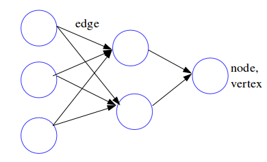
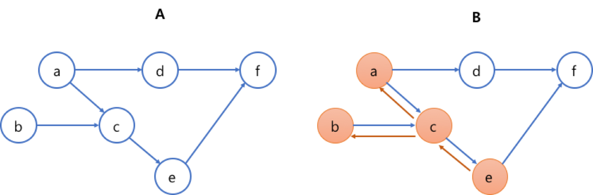
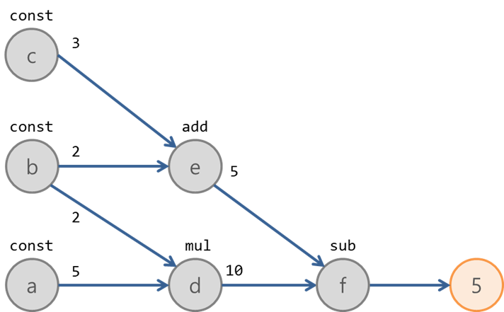
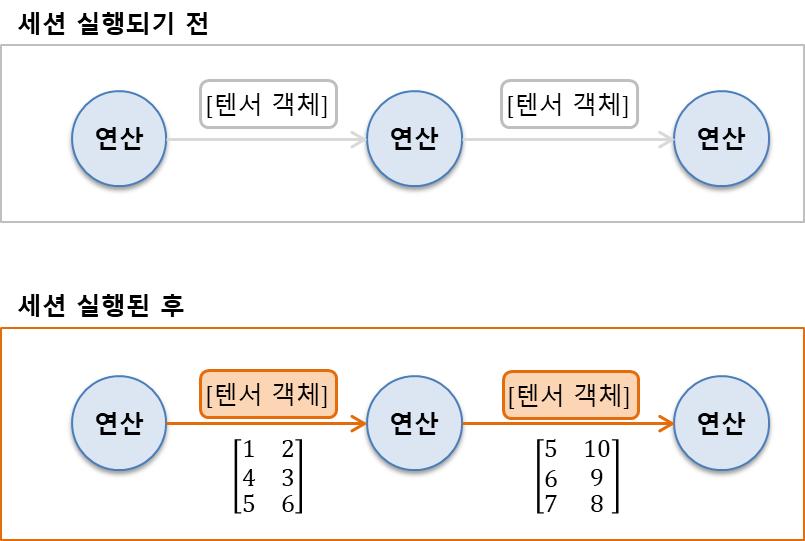
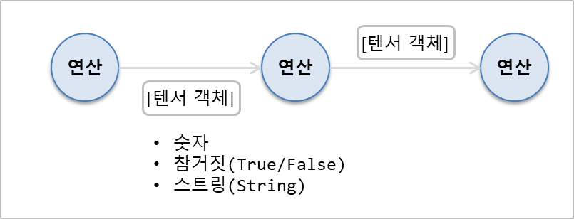
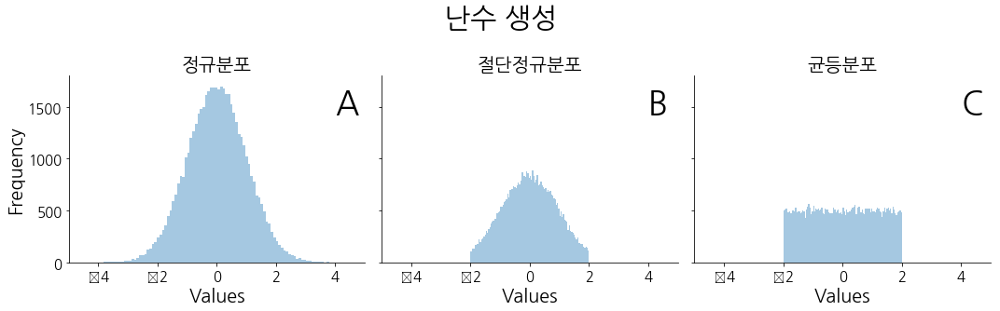

# Chap03 - 텐서플로의 기본 이해하기

텐서플로의 핵심 구축 및 동작원리를 이해하고, 그래프를 만들고 관리하는 방법과 상수, 플레이스홀더, 변수 등 텐서플로의 '구성 요소'에 대해 알아보자.

 

## 3.1 연산 그래프

### 3.1.1 연산 그래프란?

그래프는 아래의 그림과 같이 노드(node)나 꼭지점(vertex)로 연결 되어 있는 개체(entity)의 집합을 부르는 용어다. 노드들은 변(edge)을 통해 서로 연결되어 있다. 



데이터 흐름 그래프에서(DataFlow Grapy)의 변(edge) 어떤 노드에서 다른 노드로 흘러가는(flow) 데이터의 방향을 정한다.

텐서플로에서 그래프의 각 **노드는 하나의 연산을 나타내며, 입력값을 받아 다른 노드로 전달할 결과값을 출력**한다.

 

### 3.1.2 연산 그래프의 장점

텐서플로는 그래프의 연결 상태를 기반으로 연산을 최적화한다. 각 그래프에는 노드 간에 의존관계(dependency)가 존재한다.. 예를 들어, 아래의 그림 'A'에서 노드 `e`는 노드 `c`에 **직접의존**(direct dependeny)하고 있고, 노드 `a`에는 **간접의존**(indirect dependency) 한다.



위의 그림에서 노드`e`를 계산하기 위해서는 노드 `c, b, a`만 계산 해주면 된다. 따라서, **의존관계를 이용해 연산량이 최소화**할 수 있다. 이처럼 그래프를 통해 각 노드의 모든 의존관계를 파악할 수 있다.

 

## 3.2 그래프, 세션, 페치

### 3.2.1 그래프 만들기

`import tensorflow as tf`를 통해 텐서플로를 import 하면 그 시점에 비어 있는 기본 그래프가 만들어지며, 우리가 만드는 모든 노드들은 이 기본 그래프에 자동으로 연결된다.


```python
import tensorflow as tf
```

다음과 같이 간단한 6개의 노드를 만들어 보자. 먼저 `a, b, c` 노드에 `5, 2, 3`을 대입한다.


```python
a = tf.constant(5)
b = tf.constant(2)
c = tf.constant(3)
```

다음 `d, e, f` 노드에는 `a, b, c`노드를 이용하여 간단한 연산을 수행한다.


```python
d = tf.multiply(a, b)  # a * b
e = tf.add(c, b)  # c + b
f = tf.subtract(d, e)  # d - e
```

위에서 정의한 노드 및 연산을 그래프로 그려보면 아래와 같다.



 

텐서플로에서는 위의 코드처럼 곱셈, 덧셈, 뺄셈을 텐서플로의 `tf.<operator>`를 사용하여 나타낼 수 있을 뿐만아니라 축약 연산자 즉, `*, +, -` 등을 사용할 수 있다.

| TensorFlow 연산      | 축약 연산자 | 설명                                                       |
| -------------------- | ----------- | ---------------------------------------------------------- |
| `tf.add()`           | `a + b`     | a와 b를 더함                                               |
| `tf.multiply()`      | `a * b`     | a와 b를 곱함                                               |
| `tf.subtract()`      | `a - b`     | a에서 b를 뺌                                               |
| `tf.divide()`        | `a / b`     | a를 b로 나눔                                               |
| `tf.pow()`           | `a ** b`    | $a^b$ 를 계산                                              |
| `tf.mod()`           | `a % b`     | a를 b로 나눈 나머지를 구함                                 |
| `tf.logical_and()`   | `a & b`     | a와 b의 논리곱을 구함. `dtype`은 반드시 `tf.bool`이어야 함 |
| `tf.greater()`       | `a > b`     | $a > b$ 의 True/False 값을 반환                            |
| `tf.greater_equal()` | `a >= b`    | $a \ge b$ 의 True/False 값을 반환                          |
| `tf.less_equal()`    | `a <= b`    | $ a \le b$ 의 True/False 값을 반환                         |
| `tf.less()`          | `a < b`     | $a < b$ 의 True/False 값을 반환                            |
| `tf.negative()`      | `-a`        | a의 반대 부호 값을 반환                                    |
| `tf.logical_not()`   | `~a`        | a의 반대의 참거짓을 반환. `tf.bool` 텐서만 적용 가능       |
| `tf.abs()`           | `abs(a)`    | a의 각 원소의 절대값을 반환                              |
| `tf.logical_or()`    | `a I b`     | a와 b의 논리합을 구함. `dtype`은 반드시 `tf.bool`이어야 함 |


### 3.2.2 세션을 만들고 실행하기

3.2.1에서 정의한 노드 및 연산 그래프를 실행하려면 아래의 코드 처럼 **세션(Session)**을 만들고 실행하면 된다.


```python
import tensorflow as tf

# 노드 및 연산 그래프 정의
a = tf.constant(5)
b = tf.constant(2)
c = tf.constant(3)

d = tf.multiply(a, b)  # a * b
e = tf.add(c, b)  # c + b
f = tf.subtract(d, e)  # d - e

# 세션을 만들고 연산그래프 실행
sess = tf.Session()
outs = sess.run(f)
sess.close()
print("outs = {}".format(outs))
```

    outs = 5


먼저, `tf.Session()`에서 그래프를 시작한다. `Session`객체는 파이썬 객체와 데이터, 객체의 메모리가 할당되어 있는 실행 환경 사이를 연결하며, 중간 결과를 저장하고 최종 결과를 작업 환경으로 보내준다. 위의 코드에서는 `Session` 객체를 `sess = tf.Session()` 에 정의했다. 

연산 그래프를 실행하려면 `Session`객체의 `run()` 메소드를 사용해야한다. 위의 코드에서 `sess.run(f)`는 아래의 그림처럼 출력이 나와야 하는 `f`노드에서 시작해서 역방향으로 의존관계에 따라 노드의 연산을 수행한다. 


 

연산 수행이 완료되면 `sess.close()`를 통해 사용한 메모리를 해제하는 것이 좋다.

 

### 3.2.3 그래프의 생성과 관리

3.2.1에서 살펴 보았듯이, 텐서플로를 import 하면 바로 기본 그래프가 자동으로 만들어진다. 이 뿐만아니라 그래프를 추가로 생성하고 특정 연산의 관계를 직접 제어할 수도 있다. `tf.Graph()`는 텐서플로 객체로 표현되는 새로운 그래프를 만든다. 아래의 코드는 새로운 그래프를 만든 후 `g`에 할당한 코드이다.


```python
import tensorflow as tf 

# 새 그래프(Graph) 생성
g = tf.Graph()

print('default graph :', tf.get_default_graph())  # default graph 
print('new graph :', g)  # new graph

a = tf.constant(5)  # a 노드 생성

print('a 노드가 g 그래프와 연결 되어 있나? :', a.graph is g)
print('a 노드가 기본 그래프와 연결 되어 있나? :', a.graph is tf.get_default_graph())
```

    default graph : <tensorflow.python.framework.ops.Graph object at 0x0000025EEE9578D0>
    new graph : <tensorflow.python.framework.ops.Graph object at 0x0000025EEE975898>
    a 노드가 g 그래프와 연결 되어 있나? : False
    a 노드가 기본 그래프와 연결 되어 있나? : True


위의 코드에서 보면 기본 그래프(`tf.get_default_graph()`)와 `g` 그래프(`g = tf.Graph()`)는 다른 텐서플로 객체임을 알 수 있다. 

또한, 노드 `a`에서 `a.graph`를 통해 `a`가 어떤 그래프에 연결되어 있는지 알 수 있다. 위의 코드에서는 새로운 그래프 `g`를 생성하였지만, 이 `g`그래프를 기본 그래프로 **지정** 해주지 않아 노드 `a`는 텐서플로를 import 하면서 생성된 기본 그래프에 연결 되어 있음을 알 수 있다.

#### `with` 구문을 사용한 그래프 연결하기

Python의 `with` 구문을 이용하면 원하는 그래프와 연결할 수 있다. `with`구문은 코드 실행이 **시작** 할 때 **설정**이 필요하고 코드가 종료 되는 시점에 **해제**가 필요한 경우에 사용하면 편리한 문법이다. 

이러한 `with` 구문에서 `as_default()` 메소드를 사용하면 해당 그래프를 기본 그래프로 지정해준다


```python
import tensorflow as tf

g1 = tf.get_default_graph()
g2 = tf.Graph()

# g2 그래프가 기본 그래프인지 확인
print('g2가 기본 그래프인가? : ', g2 is tf.get_default_graph())

# with 구문을 이용한 
# g2를 기본 그래프로 지정하기
with g2.as_default():
    print('g2가 기본 그래프인가? : ', g2 is tf.get_default_graph())

# with 구문이 끝났으므로 
# g2를 기본 그래프에서 해제
print('g2가 기본 그래프인가? : ', g2 is tf.get_default_graph())
```

    g2가 기본 그래프인가? :  False
    g2가 기본 그래프인가? :  True
    g2가 기본 그래프인가? :  False


### 3.2.4 페치(fetch)

3.2.2 예제에서 `sess.run(f)` 를 통해 `f`노드를 실행했다. 이처럼 `sess.run()`의 **인자**(parameter)인 `f`를 **페치(fetches)** 라고 하며, **연산하고자 하는 그래프의 요소에 해당**한다. 페치는 하나의 노드가 되거나 노드들로 이루어진 리스트(list)이다.  


```python
with tf.Session() as sess:
    fetches = [a, b, c, d, e, f]
    outs = sess.run(fetches)
    
print("outs = {}".format(outs))
print(type(outs[0]))
```

    outs = [5, 2, 3, 10, 5, 5]
    <class 'numpy.int32'>


## 3.3 텐서의 흐름

이제 텐서플로에서 노드(node)와 엣지(edge)가 실제로 표현되는 방법 및 컨트롤하는 방법을 알아보도록 하자. 

### 3.3.1 노드는 연산, 엣지는 텐서 객체

앞의 예제에서 보았듯이, `tf.add(), tf.multiply()` 등으로 그래프에서 노드(node)를 만들 때, 실제로는 **연산 인스턴스가 생성**된다. 생성된 연산(인스턴스)들은 그래프가 실행되기 전까지는 연산한 값을 반환하지 않고, 계산된 결과를 다른 노드로 전달할 수 있는 핸들(handle), 즉 **흐름(flow)**으로 참조된다. 이러한 핸들은 그래프에서 엣지(edge)라고 할 수 있으며, 텐서 객체(Tensor object)라고 한다.

텐서플로는 모든 구성 요소가 담긴 그래프의 골격을 먼저 만들도록 설계되었다. 이 시점에는 실제 텐서(데이터)는 흐르지 않으며 연산 또한 수행되지 않는다. 세션(Session)이 실행되면 그래프에 텐서가 입력되고 연산이 수행된다.



 

아래의 예제코드는 세션이 실행되기 전과 실행된 후의 텐세객체를 출력한 예제이다. 아래의 출력결과에서 볼 수 있듯이, 텐서플로의 텐서 객체는 `name, shape, dtype` 속성이 있어 해당 객체의 특징을 확인할 수 있다.


```python
tensor_a = tf.constant([[1, 2], [3, 4]])

print('Session이 실행되기 전 :', tensor_a)

sess = tf.Session()
out = sess.run(tensor_a)
print('Session이 실행된 후 :\n', out)
```

    Session이 실행되기 전 : Tensor("Const_13:0", shape=(2, 2), dtype=int32)
    Session이 실행된 후 :
     [[1 2]
     [3 4]]


### 3.3.2 데이터 타입

그래프를 통해 전달되는 데이터의 기본 단위는 숫자, 참거짓값(`True, False`), 스트링 요소들이다. 



3.3.1의 예제에서 `tensor_a = tf.constant([[1, 2], [3, 4]])`는 데이터타입(`dtype`)을 정의하지 않았기 때문에 텐서플로가 자동으로 `int32`로 데이터 타입을 추측했다. 아래와 텐서 객체를 만들 때 데이터 타입을 정의해줄 수 있다.


```python
tensor_a = tf.constant([[1, 2], [3, 4]], dtype=tf.float64)
print(tensor_a)
print(tensor_a.dtype)
```

    Tensor("Const_14:0", shape=(2, 2), dtype=float64)
    <dtype: 'float64'>


#### 형 변환 (Casting)

텐서플로에서 일치하지 않는 두 데이터 타입을 가지고 연산을 실행하면 예외가 발생하므로 그래프에서 데이터 타입이 일치하는지 확인하는 것이 중요하다. 아래의 표와 같이 텐서플로는 다양한 데이터타입을 지원한다.

| 데이터 타입 이름 | 파이썬 데이터 타입 | 설명                                                         |
| :--------------- | :----------------- | :----------------------------------------------------------- |
| DT_FLOAT         | `tf.float32`       | 32비트 부동소수점 숫자                                       |
| DT_DOUBLE        | `tf.float64`       | 64비트 부동소수점 숫자                                       |
| DT_INT8          | `tf.int8`          | 8비트 정수                                                   |
| DT_INT16         | `tf.int16`         | 16비트 정수                                                  |
| DT_INT32         | `tf.int32`         | 32비트 정수                                                  |
| DT_INT64         | `tf.int64`         | 64비트 정수                                                  |
| DT_UINT8         | `tf.uint8`         | 8비트 부호 없는 정수                                         |
| DT_UINT16        | `tf.uint16`        | 16비트 부호 없는 정수                                        |
| DT_STRING        | `tf.string`        | 가변 길이 바이트 배열이며 텐서의 각 요소는 바이트의 배열     |
| DT_BOOL          | `tf.bool`          | 참거짓값                                                     |
| DT_COMPLEX64     | `tf.complex64`     | 2개의 32비트 부동소수점 숫자로 구성된 복소수로 각각 실수부와 허수부 |
| DT_COMPLEX128    | `tf.complex128`    | 2개의 64비트 부동소수점 숫자로 구성된 복소수로 각각 실수부와 허수부 |
| DT_QINT8         | `tf.qint8`         | 양자화 연산(quantized operation)에 사용되는 8비트 정수       |
| DT_QINT32        | `tf.qint32`        | 양자화 연산에 사용되는 32비트 정수                           |
| DT_QUINT8        | `tf.quint8`        | 양자화 연산에 사용되는 8비트 부호 없는 정수                  |

 

### 3.3.3 텐서 배열과 형태

텐서플로에서 텐서(Tensor)는 다음과 같이 두 가지 의미로 볼 수 있다.

- 그래프에서 연산의 결과, 파이썬 API에서 사용하는 객체의 이름
- $n$차원 배열을 가리키는 수학 용어. 
    - $1 \times 1$ 텐서는 스칼라, $1 \times n$ 텐서는 벡터, $n \times n$ 텐서는 행렬, $n \times n \times n$ 텐서는 3차원 배열
    - 텐서플로에서는 다차원 배열, 벡터, 행렬, 스칼라 등을 그래프에서 전달되는 모든 데이터를 **텐서**로 간주한다.

파이썬의 자료형인 리스트(list)나 NumPy의 배열을 사용하여 텐서를 초기화할 수 있다. 아래의 예제는 이 두가지를 사용하여 텐서를 초기화 하는 예제다. 


```python
import numpy as np
import tensorflow as tf

c = tf.constant([[1, 2, 3], 
                 [4, 5, 6]])
print('Python List input :', c.get_shape())

c = tf.constant(np.array([
                  [[1, 2, 3], 
                   [4, 5, 6]],
                    
                  [[1, 1, 1], 
                   [2, 2, 2]]
                ]))

print("3d NumPy array input :", c.get_shape())
```

    Python List input : (2, 3)
    3d NumPy array input : (2, 2, 3)


위의 예제에서 `get_shape()` 메소드는 텐서의 형태(shape)를 튜플로 반환한다. 튜플 원소의 개수는 텐서의 차원 수에 해댕한다. 예를 들어 `(2, 3)` 튜플은 2개의 원소로 이루어져 있는 행렬이고, 각 원소를 통해 `2 x 3`인 것을 할 수 있다.

#### 난수 생성

난수 생성은 텐서플로 변수의 초기값을 정의할 때 자주 사용되므로 중요하다. 다음 코드는 주로 사용되는 정규분포(normal distribution)와 균등분포(uniform distribution)을 구현한 코드이다. 형태(shape), 평균($\mu$), 표준편차($\sigma$)를 tf.random_normal()의 인자에 넣어주면 **정규분포**를 따르는 난수들을 생성할 수 있다.


```python
%matplotlib inline
import matplotlib
import matplotlib.pyplot as plt
from IPython.core.pylabtools import figsize

matplotlib.rc('font', family='NanumGothic')  # Linumx
# matplotlib.rc('font', family='AppleGothic')  # Mac
```


```python
sess = tf.InteractiveSession()

# === Normal and Truncated normal distribution === 
mean, std = 0, 1
x_normal = tf.random_normal((1, 50000), mean, std).eval()  # shape = (1, 50000)
x_truncated = tf.truncated_normal((1, 50000), mean, std).eval()

# === Uniform distribution ===
minval, maxval = -2, 2
x_uniform = tf.random_uniform((1, 50000), minval, maxval).eval()

sess.close()
```


```python
# matplotlib 설정 부분
def simpleaxis(ax):
    ax.spines['top'].set_visible(False)
    ax.spines['right'].set_visible(False)
    ax.get_xaxis().tick_bottom()
    ax.get_yaxis().tick_left()
    ax.tick_params(axis='both', which='major', labelsize=15)
    
def get_axis_limits(ax, scale=.8):
    return ax.get_xlim()[1]*scale, ax.get_ylim()[1]*scale

f,axarr = plt.subplots(1,3,figsize=[15,4],sharey=True)
titles = ['정규분포','절단정규분포','균등분포']

for i,x in enumerate([x_normal,x_truncated,x_uniform]):
    ax = axarr[i]
    ax.hist(x[0], bins=100, alpha=0.4)
    ax.set_title(titles[i], fontsize=20)
    ax.set_xlabel('Values', fontsize=20)
    ax.set_xlim([-5, 5])
    ax.set_ylim([0, 1800])
    
    simpleaxis(ax)
    
axarr[0].set_ylabel('Frequency', fontsize=20)
plt.suptitle('난수 생성', fontsize=30, y=1.15)

for ax,letter in zip(axarr,['A','B','C']):
    simpleaxis(ax)
    ax.annotate(letter, xy=get_axis_limits(ax),fontsize=35)

plt.tight_layout()
```




`tf.InteractiveSession()`와 `.eval()`을 사용하면 텐서 객체의 데이터를 쉽게 확인할 수 있다. 

> `tf.InteractiveSession()`은 연산 실행에 필요한 세션을 저장할 변수를 따로 지정하지 않아도 된다. 주피터 노트북과 같은 대화형 파이썬 환경에서 사용할 때 편리하다.

아래의 예제는 `tf.InteractiveSession()`, `.eval()`을 사용한 예제이다.


```python
sesss = tf.InteractiveSession()

# 0.0 ~ 4.0 을 같은 간격으로 5개 값 생성
c = tf.linspace(0.0, 4.0, 5)  

print("The content of 'c': \n {}\n".format(c.eval()))
sess.close()
```

    The content of 'c': 
     [0. 1. 2. 3. 4.]


​    

 

다음은 텐서플로에서 사용되는 초기화 함수를 표로 정리한 것이다.

| 텐서플로 연산                              | 설명                                                         |
| ------------------------------------------ | ------------------------------------------------------------ |
| `tf.constant(value)`                       | 인수 `value`에 지정한 값 또는 값들로 채워진 텐서를 생성      |
| `tf.fill(shape, value)`                    | `shape`에 지정한 형태의 텐서를 만들고, `value`에 지정한 값으로 초기화 |
| `tf.zeros(shape)`                          | `shape`에 지정한 형태의 텐서를 만들고, 모든 원소의 값을 `0`으로 초기화 |
| `tf.zeros_like(tensor)`                    | `tensor`와 동일한 타입과 형태의 텐서를 만들고, 모든 원소의 값을 `0`으로 초기화 |
| `tf.ones(shape)`                           | `shape`에 지정한 형태의 텐서를 만들고, 모든 원소의 값을 `1`로 초기화 |
| `tf.ones_like(tensor)`                     | `tensor`와 동일한 타입과 형태의 텐서를 만들고, 모든 원소의 값을 `1`로 초기화 |
| `tf.random_normal(shape, mean, stddev)`    | 정규분포를 따르는 난수를 생성                                |
| `tf.truncated_normal(shape, mean, stddev)` | 절단정규분포(평균을 기준으로 표준편차보다 크거나 작은 데이터를 제외)를 따르는 난수를 생성 |
| `tf.random_uniform(shape, minval, maxval)` | `[minval, maxval)` 구간의 균등분포의 값을 생성               |
| `tf.random_shuffle(tensor)`                | 첫 번째 차원에 따라 텐서를 무작위로 뒤섞음                   |


 

#### 행렬곱

텐서플로에서 행렬곱은 `tf.matmul()` 함수를 이용하여 연산을 수행한다. 예를 들어, 두 텐서 객체 A와 B의 행렬곱은 `tf.matmul(A, B)`로 계산할 수 있다.


```python
A = tf.constant([[1, 2], 
                 [3, 4]])

B = tf.constant([[4, 3], 
                 [2, 1]])

AB = tf.matmul(A, B)

tf.InteractiveSession()
print('matmul restlt:\n {}'.format(AB.eval()))
sess.close()
```

    matmul restlt:
     [[ 8  5]
     [20 13]]


### 3.3.4 이름

텐서플로에서는 각 텐서 객체마다 고유의 이름을 가진다. 이러한 이름은 텐서플로 내부에서 사용하는 string형태의 이름이다. 아래의 예제는 텐서 객체의 인자에 `name`을 사용해 이름을 지정한 뒤 `.name`속성을 통해 이름을 확인하는 코드다.


```python
with tf.Graph().as_default():
    c1 = tf.constant(4, dtype=tf.float64, name='c')
    c2 = tf.constant(4, dtype=tf.int32, name='c')
    
print(c1.name)
print(c2.name)
```

    c:0
    c_1:0


위의 코드에서 `c1`과 `c2` 둘 다에 `name='c'`라고 하여 같은 이름 즉, 중복된 이름을 가진다. 텐서플로에서는 **하나의 그래프 내의 객체는 동일한 이름을 가질 수 없다**. 위의 코드와 같은 경우에는 `c1`과 `c2` 두 객체를 구분하기 위해 `_숫자`가 자동으로 붙는다. 

 

#### 이름 스코프

복잡한 그래프를 처리해야 하는 경우 이를 쉽게 추적하고 관리하기 위해서 노드를 이름별로 그룹화하여 묶는 것이 편리하다. `with`구문과 `tf.name_scope('prefix')`를 사용하면 이름 스코프를 사용할 수 있다.

아래의 예제는 `c2, c3`를 `prefix_name`이라는 스코프로 그룹화한 것이다. 출력결과를 보면 텐서 객체의 이름 앞에 접두사 형태로 `prefix_name`이 붙은 것을 알 수 있다. 

접두사는 그래프를 의미에 따라 서브그래프로 나누고자 할 때 유용하며, 그래프의 구조를 시각화할 때 사용할 수 있다.


```python
with tf.Graph().as_default():
    c1 = tf.constant(4, dtype=tf.float64, name='c')
    with tf.name_scope("prefix_name"):
        c2 = tf.constant(4, dtype=tf.int32, name='c')
        c3 = tf.constant(4, dtype=tf.float64, name='c')

print('c1.name >>', c1.name)
print('c2.name >>', c2.name)
print('c3.name >>', c3.name)
```

    c1.name >> c:0
    c2.name >> prefix_name/c:0
    c3.name >> prefix_name/c_1:0


## 3.4 변수, 플레이스홀더, 간단한 최적화

### 3.4.1 변수

딥러닝 학습에서 최적화 과정은 주어진 모델의 매개변수(parameters) 즉, 가중치(및 편향)를 조정하는 것이라 할 수 있다. 텐서플로에서는 이러한 최적화 과정에서 **변수(Variable)** 라는 객체를 사용한다. 변수는 세션이 실행될 때 마다 그래프에서 고정된 상태를 유지할 수 있다. 그렇기 때문에 변수는 최적화를 위한 반복 과정에서 현재의 변수가 다음 반복 과정에 영향을 줄 수 있다.

변수의 사용은 두 단계로 나뉜다.

1. `tf.Variable()`함수를 사용해 변수를 만들고 어떤 값으로 초기화할지를 정의한다.
2. `tf.global_variables_initializer()` 메소드를 사용하여 세션에 초기화 연산을 수행해야 하며, 변수에 메모리를 할당하고 초기값을 설정하는 역할을 한다.

다른 텐서 객체와 마찬가지로 변수 또한 그래프가 실행될 때 계산된다.


```python
init_val = tf.random_normal((1, 5), 0, 1)
var = tf.Variable(init_val, name='var')
print("pre run: \n{}".format(var))

init = tf.global_variables_initializer()
with tf.Session() as sess:
    sess.run(init)
    post_var = sess.run(var)
    
print('\npost run: \n{}'.format(post_var))
```

    pre run: 
    <tf.Variable 'var:0' shape=(1, 5) dtype=float32_ref>
    
    post run: 
    [[ 0.2887228   0.50184816  1.1468904  -0.30481052 -1.4262516 ]]


위의 코드를 다시 실행할 때 마다 변수 이름인 `var`에 `_숫자`가 붙는 것을 확인할 수 있다. 따라서, 세션을 실행할 때마다 값이 덮어씌어 지는것이 아니라 새로운 변수가 만들어지는 것을 알 수 있다.

 

### 3.4.2 플레이스홀더

딥러닝에서 데이터에 대한 학습이 이루어질 때 학습할 데이터들을 입력해줘야 한다. 예를 들어, [2장](http://excelsior-cjh.tistory.com/149)에서 잠깐 살펴보았던, MNIST 데이터를 학습한다고 할때 입력값으로 MNIST 이미지 데이터를 입력값으로 넣어 줘야 했다. 텐서플로에서는 입력값을 넣어주기 위해 **플레이스홀더(placeholder)**라는 것이 있다. 플레이스홀더는 데이터를 입력받는 비어있는 변수라고 생각할 수 있다. 먼저 그래프를 구성하고, 그 그래프가 실행되는 시점에 입력 데이터를 넣어주는 데 사용한다.

플레이스홀더는 `shape` 인수를 유동적으로 지정할 수 있다. 예를 들어, `None`으로 지정되면 이 플레이스홀더는 모든 크기의 데이터를 받을 수 있다. 주로 배치단위(batch size)의 샘플 데이터 개수에 해당 되는 부분(데이터의 행)은 `None`을 사용하고, 데이터 Feature의 길이(데이터의 열)는 고정된 값을 사용한다. 

```python
ph = tf.placeholder(tf.float32, shape=(None, 10))
```

플레이스홀더를 정의하면 반드시 그래프 실행 단계에서 입력값을 넣어줘야 하며, 그렇지 않을 경우 에러가 나타난다. 입력 데이터는 딕셔너리(dictionary)형태로 `session.run()`메소드를 통해 전달된다. 딕셔너리의 키(key)는 플레이스홀더 변수 이름에 해당하며 값(value)은 list 또는 NumPy 배열이다.

```python
sess.run(s, feed_dict={ph: data})
```

다음 예제를 통해 플레이스홀더에 입력데이터를 넣어주는 것을 알아보자.


```python
x_data = np.random.randn(5, 10)
w_data = np.random.randn(10, 1)

with tf.Graph().as_default():
    x = tf.placeholder(tf.float32, shape=(5, 10))
    w = tf.placeholder(tf.float32, shape=(10, 1))
    b = tf.fill((5, 1), -1.)
    xw = tf.matmul(x, w)
    
    xwb = xw + b
    s = tf.reduce_max(xwb)
    with tf.Session() as sess:
        outs = sess.run(s, feed_dict={x: x_data, w: w_data})
    
    print("outs = {}".format(outs))
```

    outs = 3.2797560691833496


### 3.4.3 최적화

#### 손실 함수 정의하기

모델을 최적화하기 위해서는 모델의 성능을 평가할 수 있는 척도가 필요하며, 모델이 예측한 값과 관측값 사이의 불일치 정도를 확인하려면 **'거리'**를 반영하는 척도가 필요하다. 이러한 거리를 **손실(loss)**함수라고 하며, 이 **함수의 값을 최소화하는 파라미터(가중치, 편향)을 찾아내는 것**이 딥러닝 모델을 최적화하는 것이다.

보통 손실함수는 실제와 이론을 모두 구려해 가장 적절한 것을 선택하므로 정확한 손실함수는 존재하지 않는다.

#### 평균제곱오차와 교차 엔트로피

#### 평균제곱오차(MSE)

가장 흔하게 사용되는 손실함수는 평균제곱오차(MSE, Mean Square Error)이다. 모든 데이터 샘플에서 실제 관측값과 모델 예측값 사이의 차를 제곱한 값의 평균이다.


$$
L \left(y, \hat{y}\right) = \frac{1}{n} \sum_{i=1}^{n}{\left( y_i - \hat{y}_i \right)^{2}}
$$

즉, 실제 관측된 값과 모델의 적합값(fitted value, 예측값) 사이의 차이(잔차, residual)의 제곱값의 평균을 최소화하는 것이다.

텐서플로에서는 다음과 같이 MSE를 계산할 수 있다. 

```python
loss = tf.reduce_mean(tf.square(y_true - y_pred))
# OR
loss = tf.losses.mean_squared_error(y_true, y_pred)
```

 

 

#### 교차 엔트로피 (Cross Entropy)

교차 엔트로피는 주로 범주형 데이터에 사용되는 손실함수이며, 다음과 같다.

$$
CEE = - \frac{1}{n} \sum_{i}{\left[ y_i \log \hat{y}_i + (1-y_i) \log \left( 1-\hat{y}_i \right) \right]}
$$

이를 텐서플로에서 다음과 같이 작성할 수 있다.

```python
loss = tf.nn.sigmoid_cross_entropy_with_logits(labels=y_true, logits_y_pred)
loss = tf.reduce_mean(loss)
```

교차 엔트로피는 두 분포 사이의 유사성을 측정하는 척도이다. 딥러닝에서의 분류 모델은 각 클래스의 확률값을 계산하므로 실제 클래스(`y_true`)와 모델이 예측한 클래스(`y_pred`)를 비교할 수 있으며, 두 분포가 가까울수록 교차 엔트로피값은 더 작아진다.

 

#### 경사 하강법(Gradient Descent) 최적화 함수

딥러닝에서 손실함수를 최소화하는 다양한 최적화 알고리즘들이 있다. 가장 흔히 사용되는 알고리즘으로는 가중치의 집합에 대한 손실의 경사(기울기)를 이용한 **경사 하강법(gradient descent)**이 있다. 

$$
\mathrm{W} \leftarrow \mathrm{W} - \eta \frac{\partial L}{\partial \mathrm{W}}
$$


 

경사 하강법의 가장 보편적인 방법은 **확률적 경사 하강법(SGD, Stochastic Gradient Descent)**으로 학습해야할 전체 데이터를 계산하는 것이 아닌 일부 데이터를 미니배치(mini-batch, 50 ~ 500개 사이)단위로 추출하여 경사 하강법을 계산한다. 

#### 텐서플로의 경사 하강법

텐서플로에서는 경사 하강법을 간단하게 사용할 수 있다. 아래의 코드만 작성해주면 경사 하강법을 이용해 자동으로 경사값(기울기)을 구해준다. 

```python
optimizer = tf.train.GradientDescentOptimizer(learning_rate)
train = optimizer.minimize(loss)
```

 

### 3.4.4 예제를 통한 최적화 과정

앞에서 배운 내용을 토대로 선형회귀(Linear Regression)과 로지스틱 회귀(Logistic Regression) 두 모델의 매개변수(가중치, 편향)를 최적화 해보자.

#### 예제 1: Linear Regression

예제 1은 각 샘플에 가우시안 노이즈 $\varepsilon_i$를 추가한 입력 벡터 $x$일때 가중치 $w$와 편향값 $b$를 찾아내는 문제이다.

$$
y_i = w^{T} x_i + b + \varepsilon_i
$$


```python
# === Create data and simulate results ===

# shape = (2000, 3)인 정규분포(mu=0, sigma=1)
x_data = np.random.randn(2000, 3)
w_real = [0.3, 0.5, 0.1]
b_real = -0.2

# 가우시안 노이즈
noise = np.random.randn(1, 2000) * 0.1

y_data = np.matmul(w_real, x_data.T) + b_real + noise
```


```python
NUM_STEPS = 10

g = tf.Graph()
wb_ = []

with g.as_default():
    x = tf.placeholder(tf.float32, shape=[None, 3])
    y_true = tf.placeholder(tf.float32, shape=None)
    
    with tf.name_scope('inference') as scope:
        w = tf.Variable([[0, 0, 0]], dtype=tf.float32, name='weights')
        b = tf.Variable(0, dtype=tf.float32, name='bias')
        y_pred = tf.matmul(w, tf.transpose(x)) + b
        
    with tf.name_scope('loss') as scope:
        # loss = tf.reduce_mean(tf.square(y_true - y_pred))  # MSE
        loss = tf.losses.mean_squared_error(y_true, y_pred)
        
    with tf.name_scope('train') as scope:
        learning_rate = 0.5
        optimizer = tf.train.GradientDescentOptimizer(learning_rate)
        train = optimizer.minimize(loss)
        
    # Before starting, initialize the variables.
    init = tf.global_variables_initializer()
    with tf.Session() as sess:
        sess.run(init)
        for step in range(NUM_STEPS):
            sess.run(train, feed_dict={x: x_data, y_true: y_data})
            if step % 5 == 0:
                print(step, sess.run([w, b]))
                wb_.append(sess.run([w, b]))
        print(10, sess.run([w, b]))
```

    0 [array([[0.28029504, 0.4805126 , 0.10058896]], dtype=float32), -0.21319611]
    5 [array([[0.29576042, 0.4981753 , 0.1022327 ]], dtype=float32), -0.20189795]
    10 [array([[0.29576045, 0.4981753 , 0.1022327 ]], dtype=float32), -0.20189795]


위의 결과를 보면 10회 학습으로 추정 가중치 $\hat{w} = \left[0.29576045, 0.4981753 , 0.1022327 \right]$ 이고, 추정 편향값 $\hat{b} = -0.20189795$로 나타났다. 실제 매개변수 값인 $w = \left[0.3, 0.5 , 0.1 \right], b = -0.2$와 거의 비슷한 것을 알 수 있다.

 

#### 예제 2: Logistic Regression

이번에는 로지스틱 회귀를 알아보자. 로지스틱 회귀에서는 $w^{T} x + b$인 선형 성분은 로지스틱 함수인 비선형 함수의 입력이 되며, 이 함수의 결과값은 $[0, 1]$ 사이이다.

$$
\text{Pr} \left( y_i=1 | x_i \right) = \frac{1}{1+ \text{exp}^{wx_i - b}}
$$

예제 2번에서 사용하는 로지스틱 함수는 **시그모이드 함수(sigmoid function)**라고도 한다.


```python
N = 20000

def sigmoid(x):
    return 1 / (1 + np.exp(-x))

# === Create data and simulate results ===
x_data = np.random.randn(N, 3)
w_real = [0.3, 0.5, 0.1]
b_real = -0.2
wxb = np.matmul(w_real, x_data.T) + b_real

y_data_pre_noise = sigmoid(wxb)  # 이진화 전
y_data = np.random.binomial(1, y_data_pre_noise)  # 이진화 후
```


```python
NUM_STEPS = 100

g = tf.Graph()
wb_ = []
with g.as_default():
    x = tf.placeholder(tf.float32, shape=[None, 3])
    y_true = tf.placeholder(tf.float32, shape=None)
    
    with tf.name_scope('inference') as scope:
        w = tf.Variable([[0, 0, 0]], dtype=tf.float32, name='weights')
        b = tf.Variable(0, dtype=tf.float32, name='bias')
        y_pred = tf.matmul(w, tf.transpose(x)) + b
        
    with tf.name_scope('loss') as scope:
        loss =tf.nn.sigmoid_cross_entropy_with_logits(labels=y_true, logits=y_pred)
        loss = tf.reduce_mean(loss)
        
    with tf.name_scope('train') as scope:
        learning_rate = 0.5
        optimizer = tf.train.GradientDescentOptimizer(learning_rate)
        train = optimizer.minimize(loss)
        
    # Before starting, initialize the variables
    init = tf.global_variables_initializer()
    with tf.Session() as sess:
        sess.run(init)
        for step in range(NUM_STEPS):
            sess.run(train, feed_dict={x: x_data, y_true: y_data})
            if step % 10 == 0:
                print(step, sess.run([w, b]))
                wb_.append(sess.run([w, b]))
        
        print(100, sess.run([w, b]))
```

    0 [array([[0.03201461, 0.05613991, 0.01390209]], dtype=float32), -0.02239997]
    10 [array([[0.2018806 , 0.34991866, 0.08566012]], dtype=float32), -0.13928187]
    20 [array([[0.25465283, 0.43867975, 0.10675137]], dtype=float32), -0.17420112]
    30 [array([[0.2726871 , 0.46833742, 0.11364853]], dtype=float32), -0.1857122]
    40 [array([[0.27905232, 0.47861528, 0.11599838]], dtype=float32), -0.18965253]
    50 [array([[0.28132075, 0.48222345, 0.11681207]], dtype=float32), -0.19102146]
    60 [array([[0.282131  , 0.48349622, 0.11709588]], dtype=float32), -0.19150014]
    70 [array([[0.2824203 , 0.483946  , 0.11719528]], dtype=float32), -0.19166814]
    80 [array([[0.28252348, 0.48410508, 0.11723018]], dtype=float32), -0.19172719]
    90 [array([[0.28256023, 0.48416138, 0.11724245]], dtype=float32), -0.19174801]
    100 [array([[0.28257257, 0.48418012, 0.11724652]], dtype=float32), -0.19175489]

