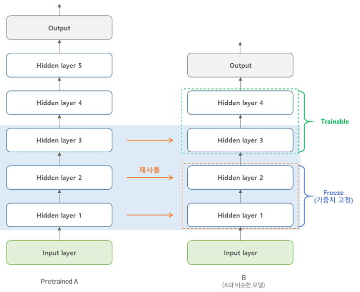

# 학습된 모델 재사용하기


## 1. Transfer Learning 이란?

규모가 매우 큰 DNN 모델을 학습 시킬 때 처음부터 새로 학습 시키는 것은 학습 속도가 느린 문제가 있다. 이러한 경우 기존에 학습된 비슷한 DNN모델이 있을 때 이 모델의 하위층(lower layer)을 가져와 재사용하는 것이 학습 속도를 빠르게 할 수 있을 뿐만아니라 학습에 필요한 Training set도 훨씬 적다.

예를 들어, 아래의 그림처럼 [CIFAR10](http://www.cs.toronto.edu/~kriz/cifar.html) 데이터셋을 분류(비행기, 자동차, 새, 고양이, 사슴, 개, 개구리, 말, 배, 트럭의 10개  클래스)하는 모델 A가 이 있다고 하자. 그런 다음, 분류된 CIFAR10 이미지에서 자동차의 종류를 분류하는 모델인 B를 학습시킨다고 할 때, 학습된 모델 A에서의 일부분(lower layer)을 재사용하여 모델 B를 학습 시킬 수 있다. 이러한 방법을 **Transfer Learning**이라고 한다.




## 2. 텐서플로 모델 재사용하기

텐서플로에서는 사전에 학습된 모델을 복원하여 새로운 모델을 학습시키는 데 사용할 수 있다. 텐서플로의 [`tf.train.Saver`](https://www.tensorflow.org/api_docs/python/tf/train/Saver)클래스를 이용해 학습된 모델을 저장하고 복원할 수 있게 해준다. `Saver`에 대한 자세한 내용은 

[[러닝 텐서플로]Chap10.1 - 모델 익스포트와 서빙,  Saver](http://excelsior-cjh.tistory.com/163?category=940399)에서 확인할 수 있다. 

먼저, 텐서플로 모델을 재사용하기 위해 모델을 학습 시키기 위한 코드 부터 작성해보도록 하자. 


### 2.1 학습된 모델 저장하기

아래의 예제 코드는, 5개의 hidden layer로 구성된 MNIST 데이터셋을 분류하는 모델이다. `tf.train.Saver`를 이용해 학습된 모델을 `'my_model.ckpt'`에 저장하는 코드이다.

```python
import os
import numpy as np
import tensorflow as tf

# MNIST Load
(train_x, train_y), (test_x, test_y) = tf.keras.datasets.mnist.load_data()

# Train & TestSet reshape
train_x = train_x.astype(np.float32).reshape(-1, 28*28) / 255.
train_y = train_y.astype(np.int32)
test_x = test_x.astype(np.float32).reshape(-1, 28*28) / 255.
test_y = test_y.astype(np.int32)

# Split Validation set from Train set
valid_x, train_x = train_x[:5000], train_x[5000:]
valid_y, train_y = train_y[:5000], train_y[5000:]

# mini-batch
def shuffle_batch(inputs, labels, batch_size):
    rnd_idx = np.random.permutation(len(inputs))
    n_batches = len(inputs) // batch_size
    for batch_idx in np.array_split(rnd_idx, n_batches):
        batch_x, batch_y = inputs[batch_idx], labels[batch_idx]
        yield batch_x, batch_y
        

################
# layer params #
################
n_inputs = 28*28
n_hidden1 = 300
n_hidden2 = 50
n_hidden3 = 50
n_hidden4 = 50
n_hidden5 = 50
n_outputs = 10

# input layer
inputs = tf.placeholder(tf.float32, shape=[None, n_inputs], name="inputs")
# output layer
labels = tf.placeholder(tf.int32, shape=[None], name='labels')

with tf.name_scope('dnn'):
    hidden1 = tf.layers.dense(inputs, n_hidden1, activation=tf.nn.relu, name="hidden1")
    hidden2 = tf.layers.dense(hidden1, n_hidden2, activation=tf.nn.relu, name='hidden2')
    hidden3 = tf.layers.dense(hidden2, n_hidden3, activation=tf.nn.relu, name='hidden3')
    hidden4 = tf.layers.dense(hidden3, n_hidden4, activation=tf.nn.relu, name='hidden4')
    hidden5 = tf.layers.dense(hidden4, n_hidden5, activation=tf.nn.relu, name='hidden5')
    logits = tf.layers.dense(hidden5, n_outputs, name='logits')
    
with tf.name_scope('loss'):
    cross_entropy = tf.reduce_mean(
        tf.nn.sparse_softmax_cross_entropy_with_logits(labels=labels, logits=logits))
    
################
# Hyper-params #
################
learning_rate = 0.01
n_epochs = 5
batch_size = 50

with tf.name_scope('train'):
    train_op = tf.train.GradientDescentOptimizer(learning_rate).minimize(cross_entropy)
    
with tf.name_scope('eval'):
    correct = tf.nn.in_top_k(logits, labels, 1)
    accuracy = tf.reduce_mean(tf.cast(correct, tf.float32))
    
# Saver 정의
MODEL_PATH = './model/'
saver = tf.train.Saver()

# 모델을 쉽게 재사용 할 수 있도록 
# 텐서플로 컬렉션(collection)에 저장
train_vars = {'inputs': inputs, 'labels': labels
              'hiddens1': hidden1, 'hiddens2': hidden2,
              'hiddens3': hidden3, 'hiddens4': hidden4,
              'hiddens5': hidden5, 'logits': logits}

for key, var in train_vars.items():
    tf.add_to_collection(key, var)

# Train
with tf.Session() as sess:
    tf.global_variables_initializer().run()
    
    for epoch in range(n_epochs):
        for batch_x, batch_y in shuffle_batch(train_x, train_y, batch_size):
            sess.run(train_op, feed_dict={inputs: batch_x, 
                                          labels:batch_y})
            
        # validation
        accuracy_val = accuracy.eval(feed_dict={inputs: valid_x, labels: valid_y})
        print('epoch: {:02d}, valid. Acc: {:.4f}'.format(epoch, accuracy_val))
    
    # model save
    save_path = saver.save(sess, os.path.join(MODEL_PATH, 'my_model.ckpt'))
    
"""
epoch: 00, valid. Acc: 0.8768
epoch: 01, valid. Acc: 0.9276
epoch: 02, valid. Acc: 0.9462
epoch: 03, valid. Acc: 0.9544
epoch: 04, valid. Acc: 0.9570
"""
```


### 2.2 학습된 모델을 이용해 4번째 레이어만 수정하기

이제 '1.1-학습된 모델 저장하기' 에서 저장한 `'my_model.ckpt'`을 이용해, 4번째 hidden layer의 노드 수를 20개로 수정한 뒤 새로운 모델을 학습시키는 코드이다. 아래의 코드는 위의 코드에서 `tf.add_to_collection`에 저장한 `inputs, labels, hidden3 `를 불러온 뒤, `new_hidden4, new_logits`을 추가한 새로운 모델을 학습하여 `my_new_model.ckpt`에 저장하는 코드이다.

```python
import tensorflow as tf

#################
# layers params #
#################
n_hidden4 = 20  # new hidden
n_outputs = 10  # new output

MODEL_PATH = './model/'
saver = tf.train.import_meta_graph(os.path.join(MODEL_PATH, 'my_model.ckpt.meta'))

inputs = tf.get_default_graph().get_collection('inputs')[0]
labels = tf.get_default_graph().get_collection('labels')[0]

hidden3 = tf.get_default_graph().get_collection('hidden3')[0]

new_hidden4 = tf.layers.dense(hidden3, n_hidden4, activation=tf.nn.relu, name='new_hidden4')
new_logits = tf.layers.dense(new_hidden4, n_outputs, name='new_logits')

with tf.name_scope('new_loss'):
    cross_entropy = tf.reduce_mean(
        tf.nn.sparse_softmax_cross_entropy_with_logits(labels=labels, logits=new_logits))
    
################
# Hyper-params #
################
learning_rate = 0.001
n_epochs = 5
batch_size = 50

with tf.name_scope('new_train'):
    train_op = tf.train.AdamOptimizer(learning_rate).minimize(cross_entropy)
    
with tf.name_scope('new_eval'):
    correct = tf.nn.in_top_k(new_logits, labels, 1)
    accuracy = tf.reduce_mean(tf.cast(correct, tf.float32))

# New Saver
new_saver = tf.train.Saver()
    
# Train the New Model
with tf.Session() as sess:
    tf.global_variables_initializer().run()
    saver.restore(sess, os.path.join(MODEL_PATH, 'my_model.ckpt'))
    
    for epoch in range(n_epochs):
        for batch_x, batch_y in shuffle_batch(train_x, train_y, batch_size):
            sess.run(train_op, feed_dict={inputs: batch_x, 
                                          labels: batch_y})
            
        # validation
        accuracy_val = accuracy.eval(feed_dict={inputs: valid_x, labels: valid_y})
        print('epoch: {:02d}, valid. Acc: {:.4f}'.format(epoch, accuracy_val))
    
    # save the new model
    save_path = new_saver.save(sess, os.path.join(MODEL_PATH, 'my_new_model.ckpt'))
    
"""
INFO:tensorflow:Restoring parameters from ./model/my_model.ckpt
epoch: 00, valid. Acc: 0.9548
epoch: 01, valid. Acc: 0.9732
epoch: 02, valid. Acc: 0.9696
epoch: 03, valid. Acc: 0.9746
epoch: 04, valid. Acc: 0.9752
"""
```


## 3. 텐서플로를 이용한 Transfer Learning

이번에는 텐서플로를 이용해 '1. Transfer Learning이란'에서 살펴본 Transfer Learning을 구현해보도록 하자. '2.1 학습된 모델 저장하기'의 예제코드를 통해 저장한 `'my_model.ckpt'`에서 `hidden1, hidden2` 레이어는 Freezing(동결)한 뒤 재사용 하고, `hidden3`레이어는 Freezing하지 않고 재사용(즉, 학습시킨 다는 의미)한다. 그리고 마지막으로 `hidden4, logits`를 새로 만들어 transfer learning을 수행해보자. 


### 3.1 재사용할 레이어 동결(freezing)하는 방법 (1)

우선, 학습시킬 레이어(`hidden3, hidden4, logits`)와 동결(학습시키지 않을)할 레이어(`hidden1, hidden2`)를 텐서플로의 [`tf.get_collection()`](https://www.tensorflow.org/api_docs/python/tf/get_collection)을 이용하여 다음과 같이 설정해줘야 한다.

- **학습시킬 레이어**(`hidden3, hidden4, logits`) : `tf.get_collection()`의 `sope`인자에 정규표현식으로 학습시킬 레이어를 아래의 코드처럼 `'hidden[34]|logits'`라고 지정하면 텐서의 `name`이 매칭되는 레이어를 찾는다. 그런 다음 `optimizer.minimize()`의 `var_list`인자에 넣어주면 된다.

```python
# 학습시킬 레이러 설정 예시
optimizer = tf.train.GradientDescentOptimizer(learning_rate)
train_vars = tf.get_collection(tf.GraphKeys.TRAINABLE_VARIABLES, 
             			       scope='hidden[34]|logits')  # 정규표현식
train_op = optimizer.minimize(loss, var_list=train_vars)
```


- **재사용할 레이어**(`hidden1~3`) : 마찬가지로, `tf.get_collection()`의 `scope`인자에 정규표현식으로 `'hidden[123]'`을 넣어준 뒤 `tf.train.Saver()`에 넣어준다.

```python
# 재 사용할 레이어 불러오는 예시
reuse_vars = tf.get_collection(tf.GraphKeys.GLOBAL_VARIABLES,
                               scope='hidden[123]') # 정규표현식
restore_saver = tf.train.Saver(reuse_vars)

with tf.Session() as sess:
    restore_saver.restore(sess, './model/my_model.ckpt')
```


이제, 위에서 살펴본 내용을 토대로 재사용할 하위층(low layer)을 동결시킨 후 새로운 레이어를 추가한 새로운 모델을 학습시켜 보자.

```python
n_inputs = 28 * 28  # MNIST
n_hidden1 = 300  # Reusing
n_hidden2 = 50  # Reusing
n_hidden3 = 50  # Reusing
n_hidden4 = 20  # New
n_outputs = 10  # New

inputs = tf.placeholder(tf.float32, shape=[None, n_inputs], name='inputs')
labels = tf.placeholder(tf.int32, shape=[None], name='labels')

with tf.name_scope('dnn'):
    hidden1 = tf.layers.dense(inputs, n_hidden1, 
                              activation=tf.nn.relu, name='hidden1')  # Reusing
    hidden2 = tf.layers.dense(hidden1, n_hidden2, 
                              activation=tf.nn.relu, name='hidden2')  # Reusing   
    hidden3 = tf.layers.dense(hidden2, n_hidden3, 
                              activation=tf.nn.relu, name='hidden3')  # Reusing   
    hidden4 = tf.layers.dense(hidden3, n_hidden4, 
                              activation=tf.nn.relu, name='hidden4')  # New  
    logits = tf.layers.dense(hidden4, n_outputs, name='logits')  # new
    
with tf.name_scope('loss'):
    cross_entropy = tf.reduce_mean(
        tf.nn.sparse_softmax_cross_entropy_with_logits(labels=labels, logits=logits))
    
################
# Hyper-params #
################
learning_rate = 0.01
n_epochs = 5
batch_size = 50

with tf.name_scope('train'):
    optimizer = tf.train.GradientDescentOptimizer(learning_rate)
    train_vars = tf.get_collection(tf.GraphKeys.TRAINABLE_VARIABLES,
                                   scope='hidden[34]|logits')
    train_op = optimizer.minimize(cross_entropy, var_list=train_vars)
    
with tf.name_scope('eval'):
    correct = tf.nn.in_top_k(logits, labels, 1)
    accuracy = tf.reduce_mean(tf.cast(correct, tf.float32))
    
# New Saver 정의
MODEL_PATH = './model/'
new_saver = tf.train.Saver()

# Reusing layer load
reuse_vars = tf.get_collection(tf.GraphKeys.GLOBAL_VARIABLES,
                               scope='hidden[123]')
restore_saver = tf.train.Saver(reuse_vars)

# Train the New Model
with tf.Session() as sess:
    tf.global_variables_initializer().run()
    restore_saver.restore(sess, os.path.join(MODEL_PATH, 'my_model.ckpt'))
    
    for epoch in range(n_epochs):
        for batch_x, batch_y in shuffle_batch(train_x, train_y, batch_size):
            sess.run(train_op, feed_dict={inputs: batch_x, 
                                          labels: batch_y})
            
        # validation
        accuracy_val = accuracy.eval(feed_dict={inputs: valid_x, labels: valid_y})
        print('epoch: {:02d}, valid. Acc: {:.4f}'.format(epoch, accuracy_val))
    
    # save the new model
    save_path = new_saver.save(sess, os.path.join(MODEL_PATH, 'my_transfer_model.ckpt'))
    
'''
INFO:tensorflow:Restoring parameters from ./model/my_model.ckpt
epoch: 00, valid. Acc: 0.9480
epoch: 01, valid. Acc: 0.9516
epoch: 02, valid. Acc: 0.9580
epoch: 03, valid. Acc: 0.9578
epoch: 04, valid. Acc: 0.9584
'''
```


### 3.2 재사용할 레이어 동결(freezing)하는 방법 (2)

3.1에서 처럼 `optimizer.minimize()`의 `var_list`의 인자로 학습 시킬 레이어를 지정해주는 방법 말고 [`tf.stop_gradient()`](https://www.tensorflow.org/api_docs/python/tf/stop_gradient)를 사용해 Transfer Learning을 수행할 수 있다. 아래의 예시 코드처럼 동결(freezing)시킬 마지막 레이어(여기서는 `hidden2`) 바로뒤에 `tf.stop_gradient()`를 넣어주면 된다.

```python
# tf.stop_gradient()를 사용한 Transfer Learning
hidden2 = tf.layers.dense(hidden1, ...)
hidden2_stop = tf.stop_gradient(hidden2)
hidden3 = tf.layers.dense(hidden2_stop, ...)
# ...
```


아래의 코드는 3.1의 예제코드를 `tf.stop_gradient()`를 사용해 작성한 코드이다.

```python
n_inputs = 28 * 28  # MNIST
n_hidden1 = 300  # Reusing
n_hidden2 = 50  # Reusing
n_hidden3 = 50  # Reusing
n_hidden4 = 20  # New
n_outputs = 10  # New

inputs = tf.placeholder(tf.float32, shape=[None, n_inputs], name='inputs')
labels = tf.placeholder(tf.int32, shape=[None], name='labels')

with tf.name_scope('dnn'):
    hidden1 = tf.layers.dense(inputs, n_hidden1, 
                              activation=tf.nn.relu, name='hidden1')  # Reusing
    hidden2 = tf.layers.dense(hidden1, n_hidden2, 
                              activation=tf.nn.relu, name='hidden2')  # Reusing
    hidden2_stop = tf.stop_gradient(hidden2)  # freezing
    hidden3 = tf.layers.dense(hidden2_stop, n_hidden3, 
                              activation=tf.nn.relu, name='hidden3')  # Reusing   
    hidden4 = tf.layers.dense(hidden3, n_hidden4, 
                              activation=tf.nn.relu, name='hidden4')  # New  
    logits = tf.layers.dense(hidden4, n_outputs, name='logits')  # new
    
with tf.name_scope('loss'):
    cross_entropy = tf.reduce_mean(
        tf.nn.sparse_softmax_cross_entropy_with_logits(labels=labels, logits=logits))
    
################
# Hyper-params #
################
learning_rate = 0.01
n_epochs = 5
batch_size = 50

with tf.name_scope('train'):
    train_op = tf.train.GradientDescentOptimizer(learning_rate).minimize(cross_entropy)
    
with tf.name_scope('eval'):
    correct = tf.nn.in_top_k(logits, labels, 1)
    accuracy = tf.reduce_mean(tf.cast(correct, tf.float32))
    
# New Saver 정의
MODEL_PATH = './model/'
new_saver = tf.train.Saver()

# Reusing layer load
reuse_vars = tf.get_collection(tf.GraphKeys.GLOBAL_VARIABLES,
                               scope='hidden[123]')
restore_saver = tf.train.Saver(reuse_vars)

# Train the New Model
with tf.Session() as sess:
    tf.global_variables_initializer().run()
    restore_saver.restore(sess, os.path.join(MODEL_PATH, 'my_model.ckpt'))
    
    for epoch in range(n_epochs):
        for batch_x, batch_y in shuffle_batch(train_x, train_y, batch_size):
            sess.run(train_op, feed_dict={inputs: batch_x, 
                                          labels: batch_y})
            
        # validation
        accuracy_val = accuracy.eval(feed_dict={inputs: valid_x, labels: valid_y})
        print('epoch: {:02d}, valid. Acc: {:.4f}'.format(epoch, accuracy_val))
    
    # save the new model
    save_path = new_saver.save(sess, os.path.join(MODEL_PATH, 'my_transfer_model2.ckpt'))

'''
INFO:tensorflow:Restoring parameters from ./model/my_model.ckpt
epoch: 00, valid. Acc: 0.9504
epoch: 01, valid. Acc: 0.9544
epoch: 02, valid. Acc: 0.9554
epoch: 03, valid. Acc: 0.9562
epoch: 04, valid. Acc: 0.9576
'''
```


### 3.3 동결시킨 층 캐싱하기

3.1과 3.2에서 `hidden1, hidden2`레이어를 재사용함과 동시에 동결(freezing) 시켰는데, 이러한 동결된 레이어는 변하지 않으므로 가장 마지막 동결된 레이어(`hidden2`)에서 나온 출력을 다음과 **캐싱(caching)** 할 수 있다. 

1. 전체 Training Set으로  마지막 동결된 레이어 `hidden2`의 출력을 실행한다. →(충분한 메모리가 있다는 가정하에)
2. 학습하는 동안 Training Set에 대한 미니배치가 아닌 1에서 출력한 `hidden2`레이어의 출력에 대해 미니배치를 만든 다음 레이어에 넣어준다.

```python
import numpy as np
import tensorflow as tf

n_inputs = 28 * 28  # MNIST
n_hidden1 = 300  # Reusing
n_hidden2 = 50  # Reusing
n_hidden3 = 50  # Reusing
n_hidden4 = 20  # New
n_outputs = 10  # New

inputs = tf.placeholder(tf.float32, shape=[None, n_inputs], name='inputs')
labels = tf.placeholder(tf.int32, shape=[None], name='labels')

with tf.name_scope('dnn'):
    hidden1 = tf.layers.dense(inputs, n_hidden1, 
                              activation=tf.nn.relu, name='hidden1')  # Reusing
    hidden2 = tf.layers.dense(hidden1, n_hidden2, 
                              activation=tf.nn.relu, name='hidden2')  # Reusing
    hidden2_stop = tf.stop_gradient(hidden2)  # freezing
    hidden3 = tf.layers.dense(hidden2_stop, n_hidden3, 
                              activation=tf.nn.relu, name='hidden3')  # Reusing   
    hidden4 = tf.layers.dense(hidden3, n_hidden4, 
                              activation=tf.nn.relu, name='hidden4')  # New  
    logits = tf.layers.dense(hidden4, n_outputs, name='logits')  # new
    
with tf.name_scope('loss'):
    cross_entropy = tf.reduce_mean(
        tf.nn.sparse_softmax_cross_entropy_with_logits(labels=labels, logits=logits))
    
################
# Hyper-params #
################
learning_rate = 0.01
n_epochs = 5
batch_size = 50

with tf.name_scope('train'):
    train_op = tf.train.GradientDescentOptimizer(learning_rate).minimize(cross_entropy)
    
with tf.name_scope('eval'):
    correct = tf.nn.in_top_k(logits, labels, 1)
    accuracy = tf.reduce_mean(tf.cast(correct, tf.float32))
    
# New Saver 정의
MODEL_PATH = './model/'
new_saver = tf.train.Saver()

# Reusing layer load
reuse_vars = tf.get_collection(tf.GraphKeys.GLOBAL_VARIABLES,
                               scope='hidden[123]')
restore_saver = tf.train.Saver(reuse_vars)

# Train
n_batches = len(train_x) // batch_size

with tf.Session() as sess:
    tf.global_variables_initializer().run()
    restore_saver.restore(sess, os.path.join(MODEL_PATH, 'my_model.ckpt'))
    
    # Caching
    h2_cache = sess.run(hidden2, feed_dict={inputs: train_x})
    h2_cache_valid = sess.run(hidden2, feed_dict={inputs: valid_x})
    
    for epoch in range(n_epochs):
        # mini-batch for hidden2
        shuffle_idx = np.random.permutation(len(train_x))
        hidden2_batches = np.array_split(h2_cache[shuffle_idx], n_batches)
        label_batches = np.array_split(train_y[shuffle_idx], n_batches)
        for hidden2_batch, label_batch in zip(hidden2_batches, label_batches):
            sess.run(train_op, feed_dict={hidden2: hidden2_batch, 
                                          labels: label_batch})
            
        accuracy_val = accuracy.eval(feed_dict={hidden2: h2_cache_valid,
                                                labels: valid_y})
        print('epoch: {:02d}, valid. Acc: {:.4f}'.format(epoch, accuracy_val))
    
    # save the new model
    save_path = new_saver.save(sess, os.path.join(MODEL_PATH, 'my_caching_model.ckpt'))
    
'''
INFO:tensorflow:Restoring parameters from ./model/my_model.ckpt
epoch: 00, valid. Acc: 0.9504
epoch: 01, valid. Acc: 0.9544
epoch: 02, valid. Acc: 0.9554
epoch: 03, valid. Acc: 0.9562
epoch: 04, valid. Acc: 0.9576
'''
```


## 4. 마무리

이번 포스팅에서는 Transfer Learning에 대해서 알아보았으며, 텐서플로를 이용하여 사전에 학습된 모델을 재사용하고, Transfer Learning을 수행하는 방법에 대해 알아보았다. 위의 코드에 대한 전체코드는 https://github.com/ExcelsiorCJH/Hands-On-ML/blob/master/Chap11-Training_DNN/Chap11_3-Training_DNN.ipynb 에서 확인할 수 있다.