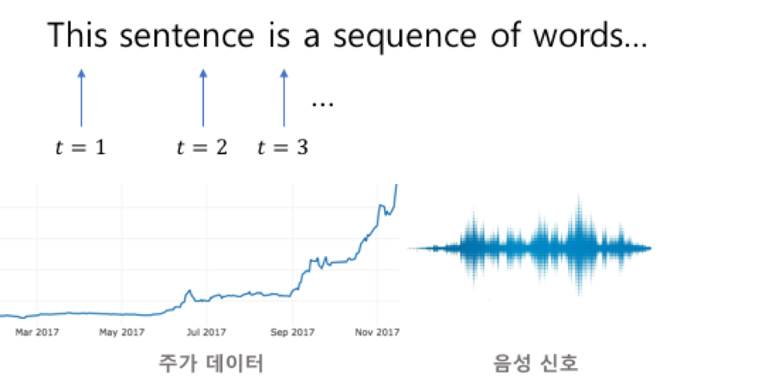
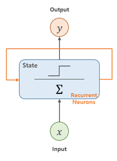
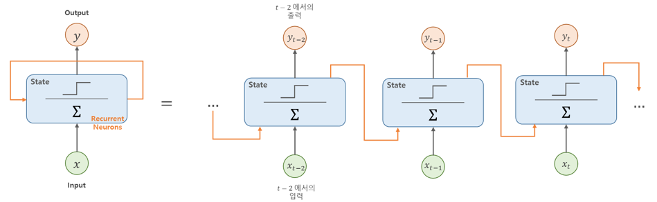
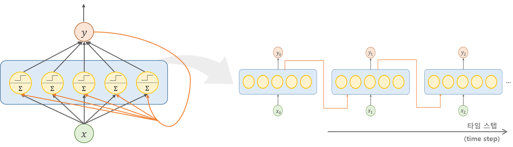
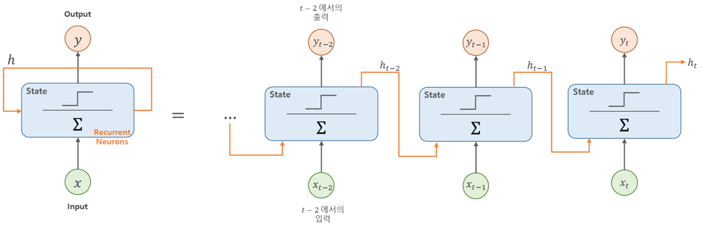
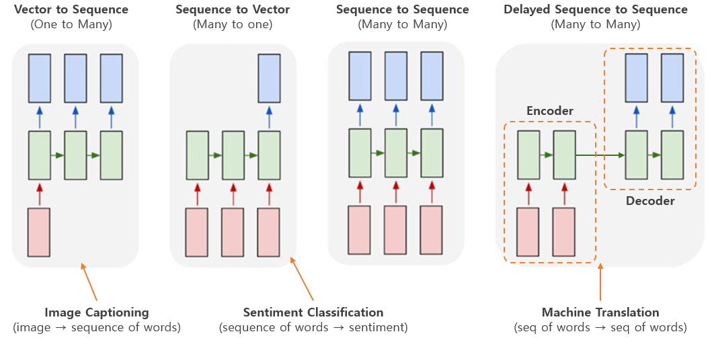
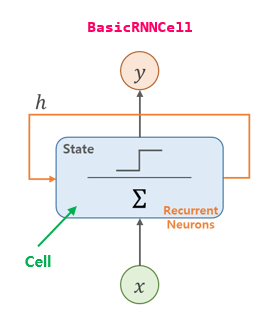
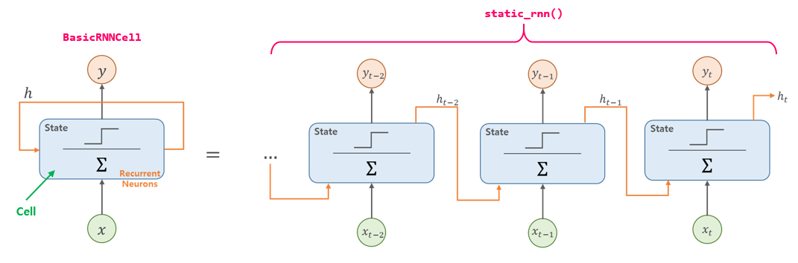

> 이번 포스팅은 [핸즈온 머신러닝](http://www.yes24.com/24/goods/59878826?scode=032&OzSrank=1) 교재, cs231n 강의를 가지고 공부한 것을 정리한 포스팅입니다. RNN에 대해 좀더 간략하게 알고 싶으신 분들은 아래의 링크를 참고하면 됩니다.
>
> - **텐서플로 실습 위주** : [[러닝 텐서플로]Chap05 - 텍스트 1: 텍스트와 시퀀스 처리 및 텐서보드 시각화](http://excelsior-cjh.tistory.com/154?category=940399)


# 07-1. 순환 신경망 (RNN, Recurrent Neural Network) - (1)


저번 포스팅인 [06. 합성곱 신경망 - CNN](http://excelsior-cjh.tistory.com/180)에서는 이미지 데이터에 적합한 모델인 CNN에 대해 알아보았다. 이번 포스팅에서는 아래의 그림과 같이 자연어(NL, Natural Language)나 음성신호, 주식과 같은 연속적인(sequential) **시계열**(time series) 데이터에 적합한 모델인 **RNN**(Recurrent Neural Network)에 대해 알아보도록 하자.




## 1. 순환 뉴런(Recurrent Neurons)

[이전 포스팅](http://excelsior-cjh.tistory.com/category/DeepLearning/%EA%B0%9C%EB%85%90)에서 살펴본 신경망은 입력층 → 출력층 한 방향으로만 흐르는 피드포워드(feedforward) 신경망이었다.  RNN(순환 신경망)은 피드포워드 신경망과 비슷하지만, 아래의 그림과 같이 출력이 다시 입력으로 받는 부분이 있다. 



 

RNN은 입력($\mathbf{x}$)을 받아 출력($\mathbf{y}$)를 만들고, 이 출력을 다시 입력으로 받는다.  일반적으로 RNN을 그림으로 나타낼 때는 위의 그림처럼 하나로 나타내지 않고, 아래의 그림처럼 각 **타임 스텝**(time step) $t$ 마다 **순환 뉴런**을 펼쳐서 타임스텝 별 입력($x_t$)과 출력($y_t$)을 나타낸다. 





순환 뉴런으로 구성된 층(layer)은 아래의 그림처럼 나타낼 수 있는데, 타임 스텝 $t$ 마다 모든 뉴런은 입력 벡터 $\mathbf{x}_t$와 이전 타임 스텝의 출력 벡터 $\mathbf{y}_{t-1}$을 입력 받는다.





각 순환 뉴런은 두 개의 가중치 $\mathbf{w}_{x}$ 와 $\mathbf{w}_{y}$ 를 가지는데, $\mathbf{w}_{x}$ 는 $\mathbf{x}_{t}$ 를 위한 것이고 $\mathbf{w}_{y}$는  이전 타임 스텝의 출력 $\mathbf{y}_{t-1}$을 위한 것이다. 이것을 순환 층(layer) 전체로 생각하면 가중치 벡터 $\mathbf{w}_{x}$ 와 $\mathbf{w}_{y}$ 를 행렬 $\mathbf{W}_{x}$ 와 $\mathbf{W}_{y}$ 로 나타낼 수 있으며 다음의 식과 같이 표현할 수 있다.

 

$$
\mathbf{y}_{t} = \phi \left( \mathbf{W}_{x}^{T}\cdot\mathbf{x}_{t} + \mathbf{W}_{y}^{T} \cdot\mathbf{y}_{t-1} + \mathbf{b} \right)
$$


그리고 타임 스텝 $t$ 에서의 미니배치(mini-batch)의 입력을 행렬 $\mathbf{X}_{t}$ 로 나타내어 아래와 같이 순환 층의 출력을 한번에 계산할 수 있다.


$$
\begin{align*}
\mathbf{Y}_{t} &= \phi \left( \mathbf{X}_{t} \cdot \mathbf{W}_{x} + \mathbf{Y}_{t-1} \cdot \mathbf{W}_{y} + \mathbf{b} \right) \\ &= \phi \left( \begin{bmatrix} \mathbf{X}_{t} & \mathbf{Y}_{t-1} \end{bmatrix}\begin{bmatrix} \mathbf{W}_{x} \\ \mathbf{W}_{y} \end{bmatrix} + \mathbf{b} \right)
\end{align*}
$$


- $\mathbf{Y}_{t}$ : 타임 스텝 $t$에서 미니배치에 있는 각 샘플(미니배치)에 대한 순환 층의 출력이며, $m \times n_{\text{neurons}}$ 행렬($m$은 미니배치, $n_{\text{neurons}}$은 뉴런 수)
- $\mathbf{X}_{t}$ : 모든 샘플의 입력값을 담고 있는 $m \times n_{\text{inputs}}$ 행렬 ($n_{\text{inputs}}$은 입력 특성 수)
- $\mathbf{W}_{x}$ : 현재 타임 스텝 $t$의 입력에 대한 가중치를 담고 있는 $n_{\text{inputs}} \times n_{\text{neurons}}$ 행렬
- $\mathbf{W}_{y}$  : 이전 타임 스텝 $t-1$ 의 출력에 대한 가중치를 담고 있는 $n_{\text{neurons}} \times n_{\text{neurons}}$  행렬
- $\mathbf{b}$ : 각 뉴런의 편향(bias)을 담고 있는 $n_{\text{neurons}}$ 크기의 벡터


위의 식에서 $\mathbf{Y}_{t}$ 는 $\mathbf{X}_t$ 와 $\mathbf{Y}_{t-1}$의 함수이므로, 타임 스텝 $t=0$ 에서부터 모든 입력에 대한 함수가 된다. 첫 번째 타임 스텝인 $t=0$ 에서는 이전의 출력이 없기 때문에 일반적으로 $0$으로 초기화 한다.


### 1.1 메모리 셀

타임 스텝 $t$ 에서 순환 뉴런의 출력은 이전 타임 스텝의 모든 입력에 대한 함수이기 때문에 이것을 **메모리**라고 볼 수 있다. 이렇게 타임 스텝에 걸쳐 어떠한 상태를 보존하는 신경망의 구성 요소를 **메모리 셀**(memory cell) 또는 셀(cell)이라고 한다. 일반적으로 타임 스텝 $t$ 에서 셀의 상태 $\mathbf{h}_{t}$ (h = hidden)는 아래의 식과 같이 타임 스텝에서의 입력과 이전 타임 스텝의 상태에 대한 함수이다.  
$$
\mathbf{h}_{t} = f \left( \mathbf{h}_{t-1}, \mathbf{x}_{t} \right)
$$


위에서 살펴본 RNN은 출력 $\mathbf{y}_{t}$ 가 다시 입력으로 들어갔지만, 아래의 그림과 같이 일반적으로 많이 사용되는 RNN은 출력 $\mathbf{y}_{t}$ 와 히든 상태(state) $\mathbf{h}_{t}$가 구분되며, 입력으로는 $\mathbf{h}_{t}$가 들어간다. RNN에서의 활성화 함수로는 $\tanh$가 주로 사용되는데, 그 이유는 LSTM을 살펴볼 때 알아보도록 하자.





위의 그림을 식으로 나타내면 다음과 같다.


$$
\begin{align*}
\mathbf{h}_{t} &= \tanh \left( \mathbf{X}_{t} \cdot \mathbf{W}_{x} + \mathbf{h}_{t-1} \cdot \mathbf{W}_{h} + \mathbf{b} \right) \\ &= \tanh \left( \begin{bmatrix} \mathbf{X}_{t} & \mathbf{h}_{t-1} \end{bmatrix}\begin{bmatrix} \mathbf{W}_{x} \\ \mathbf{W}_{h} \end{bmatrix} + \mathbf{b} \right) \\ \mathbf{Y}_{t} &= \mathbf{W}_{y}^{T} \cdot \mathbf{h}_{t}
\end{align*}
$$


### 1.2 입력과 출력 시퀀스

RNN은 아래의 그림(출처: [cs231n](http://cs231n.stanford.edu/2017/syllabus.html))과 같이 다양한 입력 시퀀스(sequence)를 받아 출력 시퀀스를 만들 수 있다. 





위의 그림에서 Vector-to-Sequence는 첫 번째 타임 스텝에서 하나의 입력만(다른 모든 타임 스텝에서는 0)을 입력받아 시퀀스를 출력하는 네트워크이며, 이러한 모델은 Image Captioning에 사용할 수 있다. Sequence-to-Vector는 Vector-to-Sequence와는 반대로 입력으로 시퀀스를 받아 하나의 벡터를 출력하는 네트워크로, Sentiment Classification에 사용할 수 있다.  

위의 그림의 오른쪽에서 세 번째 Sequence-to-Sequence 는 시퀀스를 입력받아 시퀀스를 출력하는 네트워크이며, 주식가격과 같은 시계열 데이터를 예측하는 데 사용할 수 있다.  마지막으로 Delayed Sequence-to-Sequence 는 **인코더**(encoder)에는 seq-to-vec 네트워크를 **디코더**(decoder)에는 vec-to-seq 네트워크를 연결한 것으로, 기계 번역에 사용된다.


## 2. 텐서플로로 기본 RNN 구성하기

위에서 살펴본 RNN을 텐서플로(TensorFlow)를 이용해 구현해보도록 하자. 먼저, RNN의 구조를 살펴보기 위해 텐서플로에서 제공하는 RNN을 사용하지 않고, 간단한 RNN 모델을 구현해 보도록 하자(2018-10-24 기준으로 텐서플로의 버전은 `1.11.0`이다).

아래의 코드는 $\tanh$ 를 활성화 함수로 사용하고, 5개의 뉴런으로 구성된 RNN을 구현 하였으며, 타임 스텝마다 크기 3의 입력을 받고 두개의 타임 스텝($t=0, t=1$)에 대해 작동한다.  아래의 코드는 [ExcelsiorCJH](https://github.com/ExcelsiorCJH/Hands-On-ML/blob/master/Chap14-Recurrent_Neural_Networks/Chap14-Recurrent_Neural_Networks.ipynb) 깃헙에서 확인할 수 있다.

```python
import numpy as np
import tensorflow as tf

n_inputs = 3
n_neurons = 5

X0 = tf.placeholder(tf.float32, [None, n_inputs])
X1 = tf.placeholder(tf.float32, [None, n_inputs])

Wx = tf.Variable(tf.random_normal(shape=[n_inputs, n_neurons], dtype=tf.float32))
Wy = tf.Variable(tf.random_normal(shape=[n_neurons, n_neurons], dtype=tf.float32))
b = tf.Variable(tf.zeros([1, n_neurons], dtype=tf.float32))

Y0 = tf.tanh(tf.matmul(X0, Wx) + b)
Y1 = tf.tanh(tf.matmul(Y0, Wy) + tf.matmul(X1, Wx) + b)

# input data (mini-batch)
# t = 0
X0_batch = np.array([[0, 1, 2],  # sample 0
                     [3, 4, 5],  # sample 1
                     [6, 7, 8],  # sample 2
                     [9, 0, 1]]) # sample 3
# t = 1
X1_batch = np.array([[9, 8, 7], 
                     [3, 4, 5], 
                     [6, 5, 4], 
                     [3, 2, 1]])

with tf.Session() as sess:
    tf.global_variables_initializer().run()
    Y0_val, Y1_val = sess.run([Y0, Y1], feed_dict={X0: X0_batch, X1: X1_batch})
    
print('Y0_val:{}\n{}'.format(Y0_val.shape, Y0_val))  # shape: (4, 5) → (샘플 개수, 뉴런 개수)
print('Y1_val:{}\n{}'.format(Y1_val.shape, Y1_val))

'''
Y0_val:(4, 5)
[[-0.0664006   0.9625767   0.68105793  0.7091854  -0.898216  ]
 [ 0.9977755  -0.719789   -0.9965761   0.9673924  -0.9998972 ]
 [ 0.99999774 -0.99898803 -0.9999989   0.9967762  -0.9999999 ]
 [ 1.         -1.         -1.         -0.99818915  0.9995087 ]]
Y1_val:(4, 5)
[[ 1.         -1.         -1.          0.4020025  -0.9999998 ]
 [-0.12210419  0.62805265  0.9671843  -0.9937122  -0.2583937 ]
 [ 0.9999983  -0.9999994  -0.9999975  -0.85943305 -0.9999881 ]
 [ 0.99928284 -0.99999815 -0.9999058   0.9857963  -0.92205757]]
'''
```


위의 예제는 2개의 타임 스텝에 대해서만 RNN 연산을 수행했기 때문에 간단해 보였다. 하지만, 타임 스텝이 많아 질수록 연산 그래프가 커지게 된다. 

이번에는 텐서플로에서 제공하는 RNN연산을 사용해 위와 동일한 모델을 만들어 보도록 하자.


### 2.1 정적으로 타임 스텝 펼치기

텐서플로에서 제공하는 RNN 중 [`tf.nn.rnn_cell.BasicRNNCell`](https://www.tensorflow.org/api_docs/python/tf/nn/rnn_cell/BasicRNNCell) 은 아래의 그림을 그대로 코드로 구현한 것이라고 할 수 있다.



그런 다음 [`tf.nn.static_rnn()`](https://www.tensorflow.org/api_docs/python/tf/nn/static_rnn) 함수를 호출한 뒤 셀(`BasicRNNCell`)과 입력 텐서, 그리고 입력의 데이터 타입을 알려준다. 기본적으로 모두 $0$으로 채워진 초기 상태의 행렬을 만든다.  `static_rnn()`함수는 셀의 `__call__()`함수를 호출하여 타임 스텝마다(위의 예제에서는 2개) 셀 복사본을 만들고 서로 연결해준다. 즉, 아래의 그림처럼 하나의 RNN 셀을 타임 스텝별로 펼친 것이라 할 수 있다.





`static_rnn()` 함수는 출력(output)과 상태(state)를 리턴하는데, 출력은 각 타임 스텝에서의 출력 텐서를 담고 있는 리스트(list)이고 상태는 네트워크의 최종 상태가 담겨있는 텐서이다.  따라서, 최종 상태(state)가 마지막 출력(output)과 동일하다.

아래의 코드는 `BasicRNNCell`과 `static_rnn()`을 이용해 위의 예제를 똑같이 구현한 것이다.

```python
import numpy as np
import tensorflow as tf

n_inputs = 3
n_neurons = 5

X0 = tf.placeholder(tf.float32, [None, n_inputs])
X1 = tf.placeholder(tf.float32, [None, n_inputs])

# BasicRNNCell
basic_cell = tf.nn.rnn_cell.BasicRNNCell(num_units=n_neurons)
# static_rnn()
output_seqs, states = tf.nn.static_rnn(cell=basic_cell, inputs=[X0, X1],
                                       dtype=tf.float32)
Y0, Y1 = output_seqs

# input data (mini-batch)
# t = 0
X0_batch = np.array([[0, 1, 2],  # sample 0
                     [3, 4, 5],  # sample 1
                     [6, 7, 8],  # sample 2
                     [9, 0, 1]]) # sample 3
# t = 1
X1_batch = np.array([[9, 8, 7], 
                     [3, 4, 5], 
                     [6, 5, 4], 
                     [3, 2, 1]])

with tf.Session() as sess:
    tf.global_variables_initializer().run()
    Y0_val, Y1_val = sess.run([Y0, Y1], feed_dict={X0: X0_batch, X1: X1_batch})
    
print('Y0_val:{}\n{}'.format(Y0_val.shape, Y0_val))  # shape: (4, 5) → (샘플 개수, 뉴런 개수)
print('Y1_val:{}\n{}'.format(Y1_val.shape, Y1_val))
'''
Y0_val:(4, 5)
[[ 0.30741334 -0.32884315 -0.6542847  -0.9385059   0.52089024]
 [ 0.99122757 -0.9542541  -0.7518079  -0.9995208   0.9820235 ]
 [ 0.9999268  -0.99783254 -0.8247353  -0.9999963   0.99947774]
 [ 0.996771   -0.68750614  0.8419969   0.9303911   0.8120684 ]]
Y1_val:(4, 5)
[[ 0.99998885 -0.99976057 -0.0667929  -0.9999803   0.99982214]
 [-0.6524943  -0.51520866 -0.37968948 -0.5922594  -0.08968379]
 [ 0.99862397 -0.99715203 -0.03308626 -0.9991566   0.9932902 ]
 [ 0.99681675 -0.9598194   0.39660627 -0.8307606   0.79671973]]
'''
```


#### 하나의 placeholder로 타임 스텝별 데이터 넣어주기

위의 예제에서는 타임 스텝(위의 예제에서는 2개)별 플레이스홀더(placeholder) `X0, X1`를 각각 만들어 주고, 2개의 출력 텐서(tensor) `Y0, Y1`를 정의해줬다. 위의 예제에서는 2개의 타임 스텝이어서 괜찮았지만, 만약 타임 스텝이 많아 질수록 타임 스텝별로 플레이스홀더와 출력 텐서를 정의해야하기 때문에 매우 불편하다. 이러한 문제를 해결하기 위해 [미니배치, 타임스텝, 입력크기] 형태인 `[None, n_steps, n_inputs]` 하나의 플레이스홀더 `X`를 만들어 주고, 이것을 `tf.unstack()`을 이용해 타임 스텝별로 나누어 준다. 그리고 출력 `outputs`에는 `tf.stack()`을 이용해 모든 출력 텐서들을 하나의 텐서로 합친다. 아래의 예제는 위의 예제를 하나의 플레이스홀더와 출력으로 만든 예제이다.

```python
import numpy as np
import tensorflow as tf

n_steps = 2  # time steps
n_inputs = 3  # input size
n_neurons = 5  

X = tf.placeholder(tf.float32, [None, n_steps, n_inputs])
X_seqs = tf.unstack(tf.transpose(X, perm=[1, 0, 2]))

basic_cell = tf.nn.rnn_cell.BasicRNNCell(num_units=n_neurons)
output_seqs, states = tf.nn.static_rnn(basic_cell, X_seqs, dtype=tf.float32)
outputs = tf.transpose(tf.stack(output_seqs), perm=[1, 0, 2])

# input data
X_batch = np.array([
        # t = 0      t = 1 
        [[0, 1, 2], [9, 8, 7]], # 샘플 1
        [[3, 4, 5], [3, 4, 5]], # 샘플 2
        [[6, 7, 8], [6, 5, 4]], # 샘플 3
        [[9, 0, 1], [3, 2, 1]], # 샘플 4
])

with tf.Session() as sess:
    tf.global_variables_initializer().run()
    outputs_val = outputs.eval(feed_dict={X: X_batch})
    
print('outputs_val:{}\n{}'.format(outputs_val.shape, outputs_val))
'''
outputs_val:(4, 2, 5)
[[[-0.45652324 -0.68064123  0.40938237  0.63104504 -0.45732826]
  [-0.9428799  -0.9998869   0.94055814  0.9999985  -0.9999997 ]]

 [[-0.8001535  -0.9921827   0.7817797   0.9971032  -0.9964609 ]
  [-0.637116    0.11300927  0.5798437   0.4310559  -0.6371699 ]]

 [[-0.93605185 -0.9998379   0.9308867   0.9999815  -0.99998295]
  [-0.9165386  -0.9945604   0.896054    0.99987197 -0.9999751 ]]

 [[ 0.9927369  -0.9981933  -0.55543643  0.9989031  -0.9953323 ]
  [-0.02746338 -0.73191994  0.7827872   0.9525682  -0.9781773 ]]]
'''
```


#### static_rnn()의 문제점

`static_rnn()` 함수의 문제는 타임 스텝마다 하나의 셀을 그래프에 추가하기 때문에, 만약 타임 스텝이 많아질 경우 그래프가 매우 복잡해진다는 것이다. 쉽게 말하면, `for`문과 같이 반복문을 쓰지않고 동일한 셀을 타임 스텝별로 만드는 것이라 할 수 있다. 이럴 경우 타임 스텝이 많아서 그래프가 커지게되면 역전파(backprop)시에 메모리 부족(OOM, Out-Of-Memory)에러가 발생할 수 있다. 

이러한 문제를 해결할 수 있는 방법으로는 `tf.nn.dynamic_rnn()`이 있다. 


### 2.2 동적으로 타임 스텝 펼치기

[`tf.nn.dynamic_rnn()`](https://www.tensorflow.org/api_docs/python/tf/nn/dynamic_rnn) 함수는 타임 스텝에 걸쳐 셀을 실행하기 위해 [`tf.while_loop()`](https://www.tensorflow.org/api_docs/python/tf/while_loop)를 이용하므로, `static_rnn()`함수와 달리 매 타임 스텝마다 셀을 그래프에 추가 하지 않는다. 또한, `dynamic_rnn()`함수는 위에서 하나의 플레이스홀더와 출력을 위해 `tf.stack(), tf.unstack(), tf.transpose()`와 같은 함수를 사용하지 않고, 타임 스텝의 모든 입력을 하나의 텐서(`[None, n_steps, n_inputs]`) 로 받아 RNN연산을 거친 후에 하나의 텐서(`[none, n_steps, n_neurons]`)를 출력한다. 아래의 예제는 2.1에서 예제를 `dynamic_rnn()`을 이용해 작성한 코드이다.

```python
import numpy as np
import tensorflow as tf

n_steps = 2
n_inputs = 3
n_neurons = 5

X = tf.placeholder(tf.float32, [None, n_steps, n_inputs])

basic_cell = tf.nn.rnn_cell.BasicRNNCell(num_units=n_neurons)
# dynamic_rnn()
outputs, states = tf.nn.dynamic_rnn(basic_cell, X, dtype=tf.float32)

# input data
X_batch = np.array([
        # t = 0      t = 1 
        [[0, 1, 2], [9, 8, 7]], # 샘플 1
        [[3, 4, 5], [3, 4, 5]], # 샘플 2
        [[6, 7, 8], [6, 5, 4]], # 샘플 3
        [[9, 0, 1], [3, 2, 1]], # 샘플 4
])

with tf.Session() as sess:
    tf.global_variables_initializer().run()
    outputs_val = outputs.eval(feed_dict={X: X_batch})
    
print('outputs_val:{}\n{}'.format(outputs_val.shape, outputs_val))
'''
outputs_val:(4, 2, 5)
[[[-0.85115266  0.87358344  0.5802911   0.8954789  -0.0557505 ]
  [-0.999996    0.99999577  0.9981815   1.          0.37679607]]

 [[-0.9983293   0.9992038   0.98071456  0.999985    0.25192663]
  [-0.7081804  -0.0772338  -0.85227895  0.5845349  -0.78780943]]

 [[-0.9999827   0.99999535  0.9992863   1.          0.5159072 ]
  [-0.9993956   0.9984095   0.83422637  0.99999976 -0.47325212]]

 [[ 0.87888587  0.07356028  0.97216916  0.9998546  -0.7351168 ]
  [-0.9134514   0.3600957   0.7624866   0.99817705  0.80142   ]]]
'''
```


### 2.3 가변 길이 입력/출력 시퀀스 다루기

#### 2.3.1 가변 길이 입력 시퀀스

2.1 ~ 2.2에서는 데이터의 타임 스텝이 **고정 길이**를 가진 입력 시퀀스만 다루었다. 하지만, 만약에 입력 시퀀스의 길이가 고정이지 않고 가변 길이일 경우에는 `tf.nn.dynamic_rnn()`함수에 `sequence_length` 인자를 설정해야 한다. `sequence_length`는 각 데이터 샘플의 입력 시퀀스 길이를 1D 텐서로 지정해준다. 

우선, 입력 시퀀스에 대한 예제를 보자. 아래의 코드 처럼 두번째 입력 시퀀스(샘플 2)가 두 개가 아니라 하나의 입력만 있을 경우, 입력 텐서 `X`에 맞춰 주기 위해 나머지 하나를 $0$벡터 `[0, 0, 0]`으로 채워(패딩)줘야 한다. 그리고 `dynamic_rnn()`의 `sequence_length`인자에 넣어주기 위해 데이터 샘플의 길이를 `seq_length_batch`를 만들어 준다.

```python
X_batch = np.array([
        # t = 0      t = 1 
        [[0, 1, 2], [9, 8, 7]], # 샘플 1
        [[3, 4, 5], [0, 0, 0]], # 샘플 2 (0 벡터로 패딩)
        [[6, 7, 8], [6, 5, 4]], # 샘플 3
        [[9, 0, 1], [3, 2, 1]], # 샘플 4
])
seq_length_batch = np.array([2, 1, 2, 2])  # 각 샘플 시퀀스 길이
```


아래의 예제는 위의 데이터를 가지고 2.1 ~ 2.2에서 처럼 동일한 RNN 연산을 한 코드이다. 

```python
import numpy as np
import tensorflow as tf

n_steps = 2
n_inputs = 3
n_neurons = 5

X = tf.placeholder(tf.float32, [None, n_steps, n_inputs])
seq_length = tf.placeholder(tf.int32, [None])  # 시퀀스 길이를 넣어줄 placeholder

basic_cell = tf.nn.rnn_cell.BasicRNNCell(num_units=n_neurons)
outputs, states = tf.nn.dynamic_rnn(basic_cell, X, dtype=tf.float32,
                                    sequence_length=seq_length)

# input data
X_batch = np.array([
        # t = 0      t = 1 
        [[0, 1, 2], [9, 8, 7]], # 샘플 1
        [[3, 4, 5], [0, 0, 0]], # 샘플 2 (0 벡터로 패딩)
        [[6, 7, 8], [6, 5, 4]], # 샘플 3
        [[9, 0, 1], [3, 2, 1]], # 샘플 4
])
# seq length
seq_length_batch = np.array([2, 1, 2, 2])  # 각 샘플 시퀀스 길이

with tf.Session() as sess:
    tf.global_variables_initializer().run()
    outputs_val, states_val = sess.run([outputs, states], 
                                       feed_dict={X: X_batch, seq_length: seq_length_batch})
    
print('outputs_val:{}\n{}'.format(outputs_val.shape, outputs_val))
'''
outputs_val:(4, 2, 5)
[[[-0.9123188   0.16516446  0.5548655  -0.39159346  0.20846416]
  [-1.          0.956726    0.99831694  0.99970174  0.96518576]]  # 최종 상태

 [[-0.9998612   0.6702289   0.9723653   0.6631046   0.74457586]   # 최종 상태
  [ 0.          0.          0.          0.          0.        ]]  # 0 벡터

 [[-0.99999976  0.8967997   0.9986295   0.9647514   0.93662   ]
  [-0.9999526   0.9681953   0.96002865  0.98706263  0.85459226]]  # 최종 상태

 [[-0.96435434  0.99501586 -0.36150697  0.9983378   0.999497  ]
  [-0.9613586   0.9568762   0.7132288   0.97729224 -0.0958299 ]]] # 최종 상태
'''
```

위의 출력 결과에서 확인할 수 있듯이 두번째 데이터(샘플2)에 대해서는 시퀀스 길이가 초과하는 타임 스텝에 대해서는 $0$ 벡터(`[0, 0, 0]`)를 출력하는 것을 알 수 있다.


#### 2.3.2 가변 길이 출력 시퀀스 

입력 시퀀스(데이터)의 길이는 우리가 확인할 수 있기 때문에 `sequence_length`인자에 지정할 수 있었다. 하지만, 출력 시퀀스는 입력 시퀀스의 길이와 같은 경우를 제외하고는 알 수가 없는데, 예를들어 기계번역과 같은 경우에는 출력의 시퀀스가 각각 다르게 나오기 때문에 정확한 출력 시퀀스의 길이를 알기 어렵다. 

이러한 경우에는 일반적으로 입력 시퀀스에 **EOS 토큰**(End-Of-Sequence token)을 추가하여 출력 시퀀스에서 EOS가 나왔을 때, EOS보다 뒤에 나오는 출력을 무시하는 방법을 사용한다. 


## 3. 마무리

이번 포스팅에서는 시계열 데이터에 적합한 모델인 RNN의 구조와 텐서플로를 이용해 RNN을 구현하는 방법에 대해 알아보았다. 위의 코드는 https://github.com/ExcelsiorCJH/Hands-On-ML/blob/master/Chap14-Recurrent_Neural_Networks/Chap14-Recurrent_Neural_Networks.ipynb에서 확인 할 수 있다.

다음 포스팅에서는 RNN을 학습시키는 방법과 심층 RNN에 대해 알아보도록 하자.