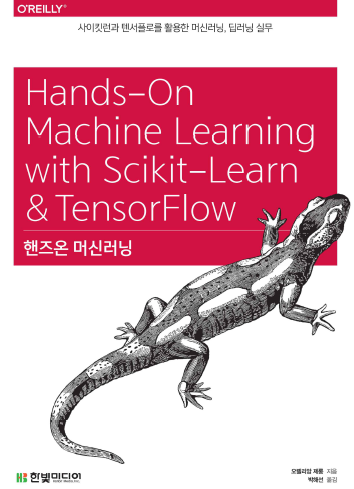

# Hands-On-ML
## 1. 교재

### 핸즈온 머신러닝(Hands-On Machine Learning)

## 2. 목차

### Part 1. 머신러닝
- Chap01 - [한눈에 보는 머신러닝](https://github.com/ExcelsiorCJH/Hands-On-ML/blob/master/Chap01-The_Machine_Learning_Landscape/Chap01-ML_Intro.pdf)
- Chap02 - [머신러닝 프로젝트 처음부터 끝까지](https://github.com/ExcelsiorCJH/Hands-On-ML/blob/master/Chap02-End_to_End_ML_Project/Chap02-End_to_End_ML_Project.ipynb)
- Chap03 - [분류](https://github.com/ExcelsiorCJH/Hands-On-ML/blob/master/Chap03-Classification/Chap03-Classification.ipynb)
- Chap04 - [모델 훈련](https://github.com/ExcelsiorCJH/Hands-On-ML/blob/master/Chap04-Training_Models/Chap04-Training_Models.ipynb)
- Chap05 - [Support Vector Machine](https://github.com/ExcelsiorCJH/Hands-On-ML/blob/master/Chap05-SVM/Chap05-SVM.ipynb)
- Chap06 - [Decision Tree](https://github.com/ExcelsiorCJH/Hands-On-ML/blob/master/Chap06-Decision_Tree/Chap06-Decision_Tree.ipynb)
- Chap07 - [앙상블 학습과 랜덤 포레스트](https://github.com/ExcelsiorCJH/Hands-On-ML/blob/master/Chap07-Ensemble_Learning_and_Random_Forests/Chap07-Ensemble_Learning_and_Random_Forests.ipynb)
- Chap08 - [차원 축소](https://github.com/ExcelsiorCJH/Hands-On-ML/blob/master/Chap08-Dimensionality_Reduction/Chap08-Dimensionality_Reduction.ipynb)

### Part 2. 신경망과 딥러닝
- Chap09 - [텐서플로 시작하기](https://github.com/ExcelsiorCJH/Hands-On-ML/tree/master/Chap09-Up_and_Running_with_TensorFlow)
- Chap10 - [인공 신경망 소개](https://github.com/ExcelsiorCJH/Hands-On-ML/blob/master/Chap10-Introduction_to_ANN/Chap10-Introduction_to_ANN.ipynb)
- Chap11 - 심층 신경망 훈련
  - [활성화 함수, 가중치 초기화](https://github.com/ExcelsiorCJH/Hands-On-ML/blob/master/Chap11-Training_DNN/Chap11_1-Training_DNN.ipynb)
  - [배치 정규화, 그래디언트 클리핑](https://github.com/ExcelsiorCJH/Hands-On-ML/blob/master/Chap11-Training_DNN/Chap11_2-Training_DNN.ipynb)
  - [학습된 모델 재사용하기](https://github.com/ExcelsiorCJH/Hands-On-ML/blob/master/Chap11-Training_DNN/Chap11_3-Training_DNN.ipynb)
  - 고속 옵티마이저 → *업로드 예정*
- Chap12 - 다중 머신과 장치를 위한 분산 텐서플로 → *업로드 예정*
- Chap13 - [합성곱 신경망](https://github.com/ExcelsiorCJH/Hands-On-ML/blob/master/Chap13-Convolutional_Neural_Networks/Chap13-Convolutional_Neural_Networks.ipynb)
- Chap14 - [순환 신경망, RNN]
    - [(1)-RNN 구조](https://github.com/ExcelsiorCJH/Hands-On-ML/blob/master/Chap14-Recurrent_Neural_Networks/Chap14_1-Recurrent_Neural_Networks.ipynb)
    - [(2)-RNN 학습시키기, Deep RNN](https://github.com/ExcelsiorCJH/Hands-On-ML/blob/master/Chap14-Recurrent_Neural_Networks/Chap14_2-Recurrent_Neural_Networks.ipynb)
    - [(3)-LSTM, GRU](https://github.com/ExcelsiorCJH/Hands-On-ML/blob/master/Chap14-Recurrent_Neural_Networks/Chap14_3-Recurrent_Neural_Networks.ipynb)
  
- Chap15 - [오토인코더(AutoEncoder)](https://github.com/ExcelsiorCJH/Hands-On-ML/blob/master/Chap15-Autoencoders/Chap15-Autoencoders.ipynb)
- Chap16 - [강화학습(RL, Reinforcement Learning)](https://github.com/ExcelsiorCJH/Hands-On-ML/blob/master/Chap16-Reinforcement_Learning/Chap16-Reinforcement_Learning.ipynb)

## 3. 참고자료

- **GitHub** : https://github.com/rickiepark/handson-ml/
- **Scikit-Learn** : http://scikit-learn.org
- **TensorFlow** : https://www.tensorflow.org
